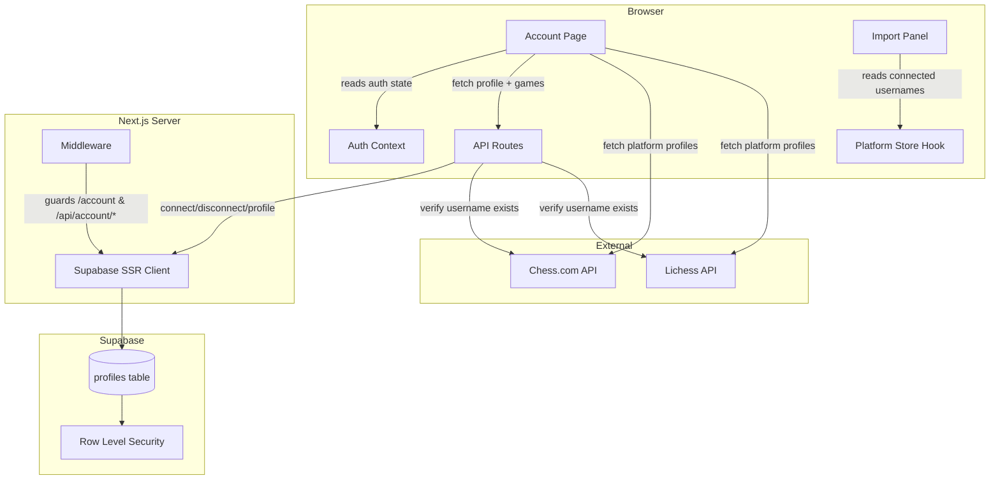
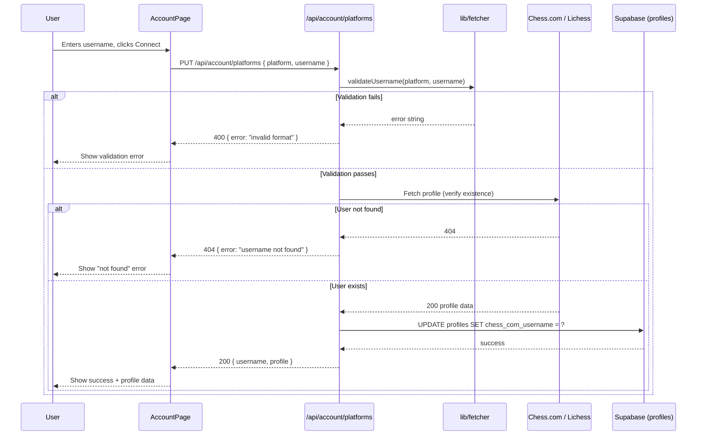
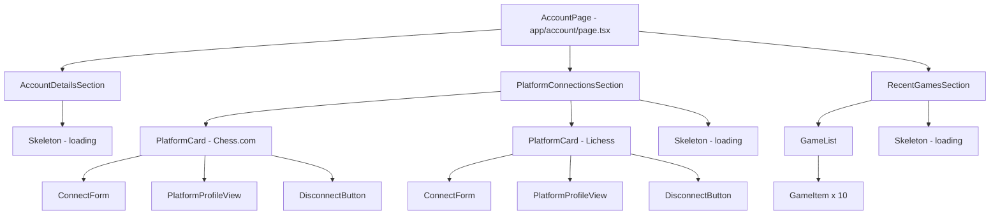

# Design Document: Account Page

## Overview

The Account Page adds a `/account` route to Toby where authenticated users manage their Chess.com and Lichess connections, view platform profiles and recent games, and see their Toby account details. It builds on the existing Supabase auth system, middleware route protection, and fetcher module — extending them with persistent platform username storage in the `profiles` table and server-side API routes for platform connection management.

### Design Goals

- **Simplicity**: Platform usernames are stored directly on the existing `profiles` table as nullable columns — no new tables or join complexity.
- **Verification before storage**: Usernames are validated against the platform's public API before being saved, ensuring only real accounts are linked.
- **Graceful degradation**: If a platform API is unavailable, the page still shows the stored username with a fallback state rather than breaking entirely.
- **Reuse existing modules**: The `lib/fetcher.ts` functions (`validateUsername`, `fetchRecentGames`) are reused for verification and game fetching. The existing middleware already protects `/account`.
- **Import panel integration**: Connected usernames flow to the landing page's ImportPanel for auto-fill, reducing friction for returning users.

### Key Dependencies (Existing)

| Module | Purpose |
|--------|---------|
| `lib/supabase/server.ts` | Server-side Supabase client for API routes |
| `lib/supabase/client.ts` | Browser Supabase client for real-time profile reads |
| `lib/fetcher.ts` | Username validation + platform API calls |
| `lib/auth-context.tsx` | Client-side auth state (`useAuth()`) |
| `middleware.ts` | Route protection (already guards `/account`) |

## Architecture

### High-Level System Diagram



### Request Flow: Connect a Platform



### Architecture Decisions

| Decision | Rationale |
|----------|-----------|
| Store usernames on `profiles` table | Avoids new table complexity; one-to-one relationship with user; existing RLS policies apply automatically |
| Server-side verification via API route | Prevents client-side spoofing; API keys/rate-limiting handled server-side; consistent error handling |
| Client-side platform data fetching for display | Profile ratings and recent games are non-sensitive public data; reduces server load; enables real-time updates |
| Single API route with method dispatch | `PUT` for connect, `DELETE` for disconnect, `GET` for reading stored usernames — clean RESTful interface |
| Hook-based platform store for ImportPanel | `usePlatformUsernames()` hook allows any component to access stored usernames without prop drilling |

## Components and Interfaces

### 1. API Route: Platform Connection (`app/api/account/platforms/route.ts`)

```typescript
// GET /api/account/platforms — Returns stored usernames
// PUT /api/account/platforms — Connect a platform (verify + save)
// DELETE /api/account/platforms — Disconnect a platform

import { NextRequest, NextResponse } from "next/server";
import { createServerSupabaseClient } from "@/lib/supabase/server";
import { validateUsername, fetchRecentGames } from "@/lib/fetcher";
import type { Platform } from "@/lib/types";

interface ConnectBody {
  platform: Platform;
  username: string;
}

interface DisconnectBody {
  platform: Platform;
}

export async function GET() {
  const supabase = await createServerSupabaseClient();
  const { data: { user } } = await supabase.auth.getUser();
  if (!user) return NextResponse.json({ error: "Unauthorized" }, { status: 401 });

  const { data, error } = await supabase
    .from("profiles")
    .select("chess_com_username, lichess_username")
    .eq("id", user.id)
    .single();

  if (error) return NextResponse.json({ error: error.message }, { status: 500 });
  return NextResponse.json(data);
}

export async function PUT(request: NextRequest) {
  const supabase = await createServerSupabaseClient();
  const { data: { user } } = await supabase.auth.getUser();
  if (!user) return NextResponse.json({ error: "Unauthorized" }, { status: 401 });

  const body: ConnectBody = await request.json();
  const { platform, username } = body;

  // Format validation
  const validationError = validateUsername(platform, username);
  if (validationError) {
    return NextResponse.json({ error: validationError }, { status: 400 });
  }

  // Verify username exists on platform
  try {
    await fetchRecentGames(platform, username.trim());
  } catch (err: unknown) {
    const message = err instanceof Error ? err.message : "Verification failed";
    if (message.includes("not found")) {
      return NextResponse.json({ error: message }, { status: 404 });
    }
    return NextResponse.json({ error: message }, { status: 502 });
  }

  // Save to database
  const column = platform === "chesscom" ? "chess_com_username" : "lichess_username";
  const { error } = await supabase
    .from("profiles")
    .update({ [column]: username.trim() })
    .eq("id", user.id);

  if (error) return NextResponse.json({ error: error.message }, { status: 500 });
  return NextResponse.json({ [column]: username.trim() });
}

export async function DELETE(request: NextRequest) {
  const supabase = await createServerSupabaseClient();
  const { data: { user } } = await supabase.auth.getUser();
  if (!user) return NextResponse.json({ error: "Unauthorized" }, { status: 401 });

  const body: DisconnectBody = await request.json();
  const { platform } = body;

  const column = platform === "chesscom" ? "chess_com_username" : "lichess_username";
  const { error } = await supabase
    .from("profiles")
    .update({ [column]: null })
    .eq("id", user.id);

  if (error) return NextResponse.json({ error: error.message }, { status: 500 });
  return NextResponse.json({ disconnected: platform });
}
```

### 2. Platform Usernames Hook (`lib/use-platform-usernames.ts`)

```typescript
"use client";

import { useEffect, useState } from "react";
import { useAuth } from "@/lib/auth-context";

export interface PlatformUsernames {
  chess_com_username: string | null;
  lichess_username: string | null;
}

interface UsePlatformUsernamesReturn {
  usernames: PlatformUsernames;
  loading: boolean;
  refetch: () => Promise<void>;
}

export function usePlatformUsernames(): UsePlatformUsernamesReturn {
  const { user } = useAuth();
  const [usernames, setUsernames] = useState<PlatformUsernames>({
    chess_com_username: null,
    lichess_username: null,
  });
  const [loading, setLoading] = useState(true);

  const fetchUsernames = async () => {
    if (!user) {
      setUsernames({ chess_com_username: null, lichess_username: null });
      setLoading(false);
      return;
    }
    try {
      const res = await fetch("/api/account/platforms");
      if (res.ok) {
        const data = await res.json();
        setUsernames(data);
      }
    } finally {
      setLoading(false);
    }
  };

  useEffect(() => {
    fetchUsernames();
  }, [user?.id]);

  return { usernames, loading, refetch: fetchUsernames };
}
```

### 3. Account Page Component Hierarchy



### 4. Account Page (`app/account/page.tsx`)

```typescript
"use client";

import { useAuth } from "@/lib/auth-context";
import { usePlatformUsernames } from "@/lib/use-platform-usernames";
import { AccountDetailsSection } from "@/components/account/AccountDetailsSection";
import { PlatformConnectionsSection } from "@/components/account/PlatformConnectionsSection";
import { RecentGamesSection } from "@/components/account/RecentGamesSection";

export default function AccountPage() {
  const { user, loading: authLoading } = useAuth();
  const { usernames, loading: usernamesLoading, refetch } = usePlatformUsernames();

  if (authLoading || usernamesLoading) {
    return <AccountPageSkeleton />;
  }

  return (
    <div className="min-h-screen px-4 pb-16 pt-5 sm:px-6">
      <main className="mx-auto w-full max-w-3xl space-y-8">
        <h1 className="font-serif text-3xl font-semibold text-[var(--ink)]">Account</h1>
        <AccountDetailsSection user={user} />
        <PlatformConnectionsSection usernames={usernames} onUpdate={refetch} />
        <RecentGamesSection usernames={usernames} />
      </main>
    </div>
  );
}
```

### 5. Platform Card Component (`components/account/PlatformCard.tsx`)

```typescript
interface PlatformCardProps {
  platform: Platform;
  connectedUsername: string | null;
  onConnect: (username: string) => Promise<void>;
  onDisconnect: () => Promise<void>;
}
```

When disconnected: shows a `ConnectForm` with username input and "Connect" button.
When connected: shows `PlatformProfileView` (fetched ratings), stored username, and a "Disconnect" button with confirmation dialog.

### 6. ImportPanel Integration

The existing `PlatformTab` component in `ImportPanel.tsx` will be modified to accept an optional `defaultUsername` prop. The `usePlatformUsernames()` hook will be called in the parent `ImportPanel` component to pass stored usernames to each platform tab.

```typescript
// Modified PlatformTab signature
interface PlatformTabProps {
  platform: Platform;
  defaultUsername?: string | null;
}
```

The `username` state initializer in `PlatformTab` will use `defaultUsername` when provided:
```typescript
const [username, setUsername] = useState(defaultUsername ?? "");
```

## Data Models

### Database Migration

```sql
-- Migration: Add platform username columns to profiles table
-- These columns store the user's connected Chess.com and Lichess usernames.
-- Nullable: user may have zero, one, or both platforms connected.

ALTER TABLE public.profiles
  ADD COLUMN chess_com_username TEXT DEFAULT NULL,
  ADD COLUMN lichess_username TEXT DEFAULT NULL;

-- No additional RLS policies needed — existing profiles policies
-- already restrict SELECT/UPDATE to auth.uid() = id.

COMMENT ON COLUMN public.profiles.chess_com_username IS 'Connected Chess.com username (verified via API)';
COMMENT ON COLUMN public.profiles.lichess_username IS 'Connected Lichess username (verified via API)';
```

### Extended Profile Type

```typescript
// Updated lib/supabase/types.ts
export interface Profile {
  id: string;
  display_name: string | null;
  avatar_url: string | null;
  chess_com_username: string | null;
  lichess_username: string | null;
  created_at: string;
  last_login_at: string;
}
```

### New TypeScript Interfaces

```typescript
// lib/account-types.ts

import type { Platform, GameListItem } from "@/lib/types";

/** Stored platform connection data from the profiles table */
export interface PlatformUsernames {
  chess_com_username: string | null;
  lichess_username: string | null;
}

/** Platform profile data fetched from the external API */
export interface PlatformProfile {
  username: string;
  platform: Platform;
  ratings: PlatformRating[];
}

/** A single rating entry for a time control */
export interface PlatformRating {
  timeControl: string;
  rating: number;
}

/** Request body for PUT /api/account/platforms */
export interface ConnectPlatformRequest {
  platform: Platform;
  username: string;
}

/** Request body for DELETE /api/account/platforms */
export interface DisconnectPlatformRequest {
  platform: Platform;
}

/** Response from GET /api/account/platforms */
export type PlatformUsernamesResponse = PlatformUsernames;

/** Error response shape from API routes */
export interface ApiError {
  error: string;
}
```


## Correctness Properties

*A property is a characteristic or behavior that should hold true across all valid executions of a system — essentially, a formal statement about what the system should do. Properties serve as the bridge between human-readable specifications and machine-verifiable correctness guarantees.*

### Property 1: Username format validation gate

*For any* string submitted as a platform username, if `validateUsername(platform, username)` returns a non-null error, then the connect API SHALL reject the request with a 400 status and the stored username in the database SHALL remain unchanged from its value before the request.

**Validates: Requirements 1.2, 1.4**

### Property 2: Platform connection combinations

*For any* valid combination of platform connection state (none connected, only Chess.com connected, only Lichess connected, or both connected), saving that combination to the profiles table and then reading it back SHALL return the exact same combination of usernames.

**Validates: Requirements 1.5**

### Property 3: Disconnect removes stored username

*For any* platform (Chess.com or Lichess) that has a stored username, calling the disconnect operation for that platform SHALL result in the corresponding column being null, while the other platform's username (if any) remains unchanged.

**Validates: Requirements 3.1**

### Property 4: Profile view displays all required fields

*For any* valid PlatformProfile object containing a username and a non-empty array of ratings, rendering the PlatformProfileView component SHALL produce output containing the username string and every rating's time control label and numeric value.

**Validates: Requirements 4.2**

### Property 5: Recent games display capped at 10

*For any* list of N games returned from a platform API (where N ≥ 0), the Account Page's recent games section SHALL display exactly `min(N, 10)` game items.

**Validates: Requirements 5.1**

### Property 6: Game item displays required fields

*For any* GameListItem object with non-empty white, black, result, timeControl, and date fields, rendering that game item SHALL produce output containing all five values.

**Validates: Requirements 5.2**

### Property 7: Import panel pre-fills stored username for connected platform

*For any* platform that has a stored username in the profiles table, when the corresponding import tab is selected, the username input field SHALL be initialized with the stored username value.

**Validates: Requirements 7.1, 7.2**

### Property 8: Data isolation between users

*For any* two distinct authenticated users A and B, a GET request to `/api/account/platforms` made by user A SHALL never return usernames stored by user B, and a PUT/DELETE request by user A SHALL never modify user B's stored usernames.

**Validates: Requirements 8.2**

## Error Handling

### API Route Errors

| Scenario | HTTP Status | Response | Client Behavior |
|----------|-------------|----------|-----------------|
| Unauthenticated request | 401 | `{ error: "Unauthorized" }` | Middleware redirects to login (page routes) or returns 401 (API routes) |
| Username format validation failure | 400 | `{ error: "<validation message>" }` | Show inline error below input field |
| Username not found on platform | 404 | `{ error: "User not found on <platform>" }` | Show "not found" error with suggestion to check spelling |
| Platform API rate-limited | 502 | `{ error: "Rate limited by <platform>..." }` | Show error with "try again later" message |
| Platform API unavailable/timeout | 502 | `{ error: "<descriptive message>" }` | Show error with retry button |
| Database write failure | 500 | `{ error: "<db error message>" }` | Show generic "something went wrong" error with retry |
| Invalid request body (missing fields) | 400 | `{ error: "platform and username are required" }` | Prevented by client-side validation |

### Client-Side Error States

| Scenario | Handling |
|----------|----------|
| Platform profile fetch fails (for display) | Show fallback state: stored username + "Live data unavailable" indicator; do NOT block the page |
| Recent games fetch fails | Show error message with retry button in the games section |
| Network disconnection during connect/disconnect | Toast notification with retry suggestion; optimistic UI reverted |
| Session expired mid-page | Auth context detects state change, redirects to login via middleware on next API call |

### Error Recovery Patterns

- **Retry with backoff**: Platform API errors (502) offer a retry button. Client waits 2s before allowing retry.
- **Optimistic UI revert**: Disconnect confirmation immediately removes the platform card from UI. If the DELETE fails, the card reappears with an error toast.
- **Graceful degradation**: The account page renders in layers — account details load independently of platform data. A failure in platform API doesn't block showing account info.

## Testing Strategy

### Unit Tests (Example-Based)

Unit tests cover specific scenarios, edge cases, and integration points:

- **API route handlers**: Test each route (GET, PUT, DELETE) with mocked Supabase client
  - Happy path: valid connect, successful disconnect, read stored usernames
  - Error cases: unauthenticated requests, validation failures, platform not found, API unavailable
- **Component rendering**: Test key UI states
  - Account details display with known user data
  - Platform card: disconnected state (shows connect form), connected state (shows profile)
  - Loading skeletons appear during pending states
  - Confirmation dialog before disconnect
- **ImportPanel pre-fill**: Test that `defaultUsername` prop initializes the input correctly
- **Middleware redirect**: Verify unauthenticated access to `/account` redirects to `/login?returnUrl=/account`

### Property-Based Tests (fast-check)

Property-based tests verify universal correctness guarantees across generated inputs:

- **Library**: `fast-check` (already in devDependencies)
- **Minimum iterations**: 100 per property
- **Tag format**: `Feature: account-page, Property {N}: {title}`

Properties to implement:

1. **Username format validation gate** — Generate random strings (valid and invalid per platform regex), verify `validateUsername` output consistency and that invalid inputs are always rejected by the connect flow.
2. **Platform connection combinations** — Generate all valid combinations of `(chess_com_username: string | null, lichess_username: string | null)`, verify round-trip through save/read.
3. **Disconnect removes stored username** — Generate a platform choice and a stored username, disconnect, verify nullification without side effects on the other platform.
4. **Profile view displays all required fields** — Generate random `PlatformProfile` objects, render, verify all fields present in output.
5. **Recent games display capped at 10** — Generate arrays of 0–50 `GameListItem` objects, verify displayed count is `min(length, 10)`.
6. **Game item displays required fields** — Generate random `GameListItem` objects, render, verify all five fields present.
7. **Import panel pre-fills stored username** — Generate valid usernames per platform, verify input initialization.
8. **Data isolation** — Generate two distinct user IDs with different stored usernames, verify API isolation.

### Integration Tests

- **Database migration**: Verify columns exist, are nullable TEXT, and existing RLS policies apply.
- **End-to-end connect flow**: Submit a real (or mocked) username → verify API call → verify database write → verify UI update.
- **End-to-end disconnect flow**: Confirm dialog → DELETE → verify null in DB → verify UI update.
- **Platform API verification**: Mock external APIs to test the verification step in isolation from actual Chess.com/Lichess.
