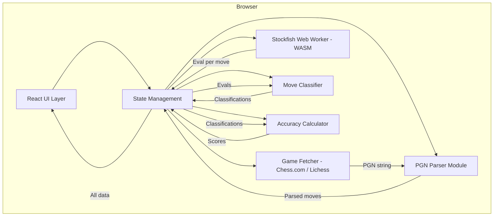
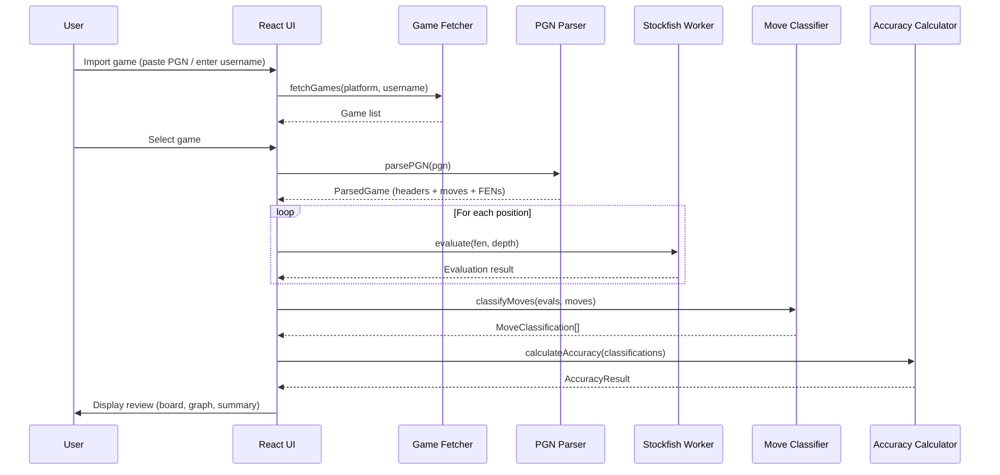

# Design Document: Chess Game Review

## Overview

Chess Game Review is a client-side web application that allows users to import chess games (via PGN paste, Chess.com, or Lichess), analyze them move-by-move using Stockfish WASM running entirely in the browser, and present a comprehensive review including move classifications, accuracy scores, an evaluation graph, and a game summary. The app requires no backend or user accounts — all computation happens locally.

The architecture is structured around a pipeline: import → parse → analyze → classify → present. Each stage is decoupled so that the UI remains responsive while the engine computes in a Web Worker. The design leverages Next.js App Router for routing and layout, React state for UI interactivity, and a dedicated Stockfish Web Worker for engine analysis.

## Architecture



### Data Flow



## Components and Interfaces

### Component 1: Game Fetcher

**Purpose**: Fetches game lists and PGN data from Chess.com and Lichess public APIs.

```typescript
interface GameFetcher {
  fetchRecentGames(platform: Platform, username: string): Promise<GameListItem[]>;
  fetchGamePGN(platform: Platform, gameId: string): Promise<string>;
}

type Platform = "chesscom" | "lichess";

interface GameListItem {
  id: string;
  white: string;
  black: string;
  result: string;
  timeControl: string;
  date: string;
  pgn: string;
}
```

**Responsibilities**:
- Call Chess.com archive API (`api.chess.com/pub/player/{username}/games/archives`)
- Call Lichess API (`lichess.org/api/games/user/{username}`)
- Normalize responses into a common `GameListItem` format
- Handle rate-limiting and network errors gracefully

### Component 2: PGN Parser

**Purpose**: Parses PGN text into a structured game representation with FEN positions for each half-move.

```typescript
interface PGNParser {
  parse(pgn: string): ParsedGame;
}

interface ParsedGame {
  headers: PGNHeaders;
  moves: ParsedMove[];
  startingFen: string;
}

interface PGNHeaders {
  event?: string;
  site?: string;
  date?: string;
  white: string;
  black: string;
  result: string;
  eco?: string;
  opening?: string;
  timeControl?: string;
}

interface ParsedMove {
  moveNumber: number;
  color: "white" | "black";
  san: string;          // Standard Algebraic Notation (e.g., "Nf3")
  uci: string;          // UCI notation (e.g., "g1f3")
  fenBefore: string;    // FEN before the move
  fenAfter: string;     // FEN after the move
}
```

**Responsibilities**:
- Validate PGN syntax
- Extract headers and move text
- Replay moves on an internal board to produce FEN at each position
- Support standard PGN tags and common variations

### Component 3: Stockfish Engine Worker

**Purpose**: Runs Stockfish WASM in a Web Worker, providing position evaluations at configurable depth.

```typescript
interface StockfishEngine {
  initialize(): Promise<void>;
  evaluate(fen: string, depth: number): Promise<EngineEvaluation>;
  getBestMove(fen: string, depth: number): Promise<string>;
  terminate(): void;
  isReady(): boolean;
}

interface EngineEvaluation {
  fen: string;
  depth: number;
  score: EvalScore;
  bestMove: string;
  pv: string[];         // Principal variation
  nodes: number;
  time: number;         // ms spent
}

type EvalScore =
  | { type: "cp"; value: number }     // Centipawns from white's perspective
  | { type: "mate"; value: number };  // Mate in N (positive = white mates)
```

**Responsibilities**:
- Load Stockfish WASM binary (with SharedArrayBuffer if available, fallback to single-threaded)
- Manage UCI protocol communication
- Queue and process evaluation requests sequentially
- Report progress/depth updates
- Clean up resources on termination

### Component 4: Move Classifier

**Purpose**: Classifies each move based on win-percentage loss between the played move and the engine's best move.

```typescript
interface MoveClassifier {
  classifyMoves(
    moves: ParsedMove[],
    evaluations: EngineEvaluation[]
  ): ClassifiedMove[];
}

type MoveGrade = "book" | "best" | "excellent" | "good" | "inaccuracy" | "mistake" | "blunder";

interface ClassifiedMove extends ParsedMove {
  grade: MoveGrade;
  evalBefore: EvalScore;
  evalAfter: EvalScore;
  bestMove: string;
  winPercentBefore: number;
  winPercentAfter: number;
  winPercentLoss: number;
}
```

**Responsibilities**:
- Convert centipawn evaluations to win percentages
- Compute win-percentage loss per move
- Apply classification thresholds
- Detect book moves (first N moves matching known openings or from opening database)

### Component 5: Accuracy Calculator

**Purpose**: Computes per-side accuracy scores and game summary statistics.

```typescript
interface AccuracyCalculator {
  calculate(classifiedMoves: ClassifiedMove[]): GameAccuracy;
}

interface GameAccuracy {
  white: SideAccuracy;
  black: SideAccuracy;
  opening: OpeningInfo;
  criticalMoments: CriticalMoment[];
}

interface SideAccuracy {
  accuracy: number;       // 0-100 weighted score
  moveCount: number;
  classifications: Record<MoveGrade, number>;
  averageCentipawnLoss: number;
}

interface OpeningInfo {
  eco: string;
  name: string;
  moves: number;          // How many moves into the opening
}

interface CriticalMoment {
  moveIndex: number;
  description: string;    // e.g., "Blunder loses a piece"
  evalSwing: number;      // Win-percent swing
}
```

**Responsibilities**:
- Weight each move's accuracy contribution by position complexity
- Aggregate move grades by side
- Identify critical moments (large evaluation swings)
- Detect opening from ECO codes in PGN headers or by move matching

### Component 6: Evaluation Graph

**Purpose**: Renders an interactive SVG/Canvas chart of evaluation over the course of the game.

```typescript
interface EvalGraphProps {
  evaluations: EvalScore[];
  classifications: ClassifiedMove[];
  currentMoveIndex: number;
  onMoveClick: (moveIndex: number) => void;
}
```

**Responsibilities**:
- Plot eval (clamped to ±10 pawns) vs. move number
- Color regions by which side has the advantage
- Highlight the currently selected move
- Allow clicking on points to navigate to that move
- Mark blunders/mistakes with visual indicators

## Data Models

### Model 1: GameReviewState (Application State)

```typescript
interface GameReviewState {
  // Import phase
  importMethod: "pgn" | "chesscom" | "lichess" | null;
  rawPgn: string | null;
  gameList: GameListItem[];
  selectedGameId: string | null;

  // Parsed game
  parsedGame: ParsedGame | null;

  // Analysis phase
  analysisStatus: "idle" | "running" | "complete" | "error";
  analysisProgress: number;            // 0 to 1
  evaluations: EngineEvaluation[];
  analysisDepth: number;               // User-configurable, default 18

  // Classification phase
  classifiedMoves: ClassifiedMove[];
  gameAccuracy: GameAccuracy | null;

  // Navigation
  currentMoveIndex: number;

  // Error state
  error: string | null;
}
```

**Validation Rules**:
- `currentMoveIndex` must be between -1 (starting position) and `parsedGame.moves.length - 1`
- `analysisDepth` must be between 10 and 25
- `evaluations` array length must equal `parsedGame.moves.length + 1` (one per position including start)

### Model 2: Win Percentage Conversion

```typescript
// Lichess-style sigmoid conversion
// Maps centipawn evaluation to win probability [0, 1]
const WIN_PERCENT_MULTIPLIER = 0.00368208;

interface WinPercentConfig {
  multiplier: number;  // Controls sigmoid steepness
}
```

### Model 3: Classification Thresholds

```typescript
interface ClassificationThresholds {
  excellent: number;  // win% loss ≤ 0.5
  good: number;       // win% loss ≤ 2
  inaccuracy: number; // win% loss ≤ 5
  mistake: number;    // win% loss ≤ 10
  blunder: number;    // win% loss > 10
}

const DEFAULT_THRESHOLDS: ClassificationThresholds = {
  excellent: 0.5,
  good: 2,
  inaccuracy: 5,
  mistake: 10,
  blunder: Infinity,  // Anything above mistake threshold
};
```

## Algorithmic Pseudocode

### Main Analysis Pipeline

```typescript
async function analyzeGame(
  parsedGame: ParsedGame,
  engine: StockfishEngine,
  depth: number,
  onProgress: (progress: number) => void
): Promise<EngineEvaluation[]> {
  const positions = [parsedGame.startingFen, ...parsedGame.moves.map(m => m.fenAfter)];
  const evaluations: EngineEvaluation[] = [];

  for (let i = 0; i < positions.length; i++) {
    const evaluation = await engine.evaluate(positions[i], depth);
    evaluations.push(evaluation);
    onProgress((i + 1) / positions.length);
  }

  return evaluations;
}
```

**Preconditions:**
- `parsedGame` is a valid ParsedGame with at least 1 move
- `engine` is initialized and ready
- `depth` is between 10 and 25

**Postconditions:**
- Returns evaluations array of length `parsedGame.moves.length + 1`
- Each evaluation corresponds to the position at that index
- `onProgress` is called with monotonically increasing values from ~0 to 1

**Loop Invariants:**
- `evaluations.length === i` at the start of each iteration
- All evaluations in the array are for positions that precede index `i`

### Win Percentage Conversion Algorithm

```typescript
function centipawnToWinPercent(cp: number): number {
  // Sigmoid function: maps cp to [0, 1] representing white's win probability
  return 50 + 50 * (2 / (1 + Math.exp(-WIN_PERCENT_MULTIPLIER * cp)) - 1);
}

function evalToWinPercent(score: EvalScore, perspective: "white" | "black"): number {
  let wp: number;

  if (score.type === "mate") {
    wp = score.value > 0 ? 100 : 0;
  } else {
    wp = centipawnToWinPercent(score.value);
  }

  return perspective === "white" ? wp : 100 - wp;
}
```

**Preconditions:**
- `cp` is a finite number (centipawns from white's perspective)
- For `evalToWinPercent`: `score` is a valid EvalScore

**Postconditions:**
- `centipawnToWinPercent` returns a value in [0, 100]
- At cp=0, returns exactly 50
- Monotonically increasing with cp
- `evalToWinPercent` returns win% from the specified perspective

### Move Classification Algorithm

```typescript
function classifyMove(
  evalBefore: EvalScore,
  evalAfter: EvalScore,
  bestMoveEval: EvalScore,
  color: "white" | "black",
  moveIndex: number,
  bookMoveLimit: number,
  thresholds: ClassificationThresholds
): MoveGrade {
  // Book moves: first N moves of the game are considered book
  if (moveIndex < bookMoveLimit) {
    return "book";
  }

  const wpBefore = evalToWinPercent(evalBefore, color);
  const wpAfterBest = evalToWinPercent(bestMoveEval, color);
  const wpAfterPlayed = evalToWinPercent(evalAfter, color);

  // If played move equals best move
  if (wpAfterPlayed >= wpAfterBest - 0.1) {
    return "best";
  }

  const winPercentLoss = wpBefore - wpAfterPlayed;

  if (winPercentLoss <= thresholds.excellent) return "excellent";
  if (winPercentLoss <= thresholds.good) return "good";
  if (winPercentLoss <= thresholds.inaccuracy) return "inaccuracy";
  if (winPercentLoss <= thresholds.mistake) return "mistake";
  return "blunder";
}
```

**Preconditions:**
- `evalBefore` and `evalAfter` are valid evaluations for positions before and after the move
- `bestMoveEval` is the evaluation assuming the engine's best move was played
- `color` is the side that played the move
- `moveIndex >= 0`
- `thresholds` values are in ascending order

**Postconditions:**
- Returns exactly one MoveGrade value
- "book" returned only for moves with index < bookMoveLimit
- "best" returned when played move ≈ engine best
- Classification is monotonically worse as winPercentLoss increases

**Loop Invariants:** N/A (no loops)

### Accuracy Score Algorithm

```typescript
function calculateAccuracyScore(classifiedMoves: ClassifiedMove[], side: "white" | "black"): number {
  const sideMoves = classifiedMoves.filter(m => m.color === side && m.grade !== "book");

  if (sideMoves.length === 0) return 100;

  let totalWeight = 0;
  let weightedAccuracy = 0;

  for (const move of sideMoves) {
    // Weight by position sharpness (higher eval = more weight for the advantaged side)
    const positionWeight = Math.max(1, Math.abs(move.winPercentBefore - 50) / 10 + 1);
    const moveAccuracy = Math.max(0, 100 - move.winPercentLoss * 10);

    weightedAccuracy += moveAccuracy * positionWeight;
    totalWeight += positionWeight;
  }

  return Math.round((weightedAccuracy / totalWeight) * 10) / 10;
}
```

**Preconditions:**
- `classifiedMoves` is a non-empty array of valid ClassifiedMove objects
- `side` is "white" or "black"
- Each move has valid `winPercentBefore` and `winPercentLoss` values

**Postconditions:**
- Returns a number in [0, 100]
- Returns 100 if no non-book moves exist for the side
- Higher accuracy = fewer/smaller win-percentage losses

**Loop Invariants:**
- `totalWeight > 0` after the first iteration (since `positionWeight >= 1`)
- `weightedAccuracy / totalWeight` remains in [0, 100]

## Key Functions with Formal Specifications

### Function: parsePGN()

```typescript
function parsePGN(pgn: string): ParsedGame
```

**Preconditions:**
- `pgn` is a non-empty string
- `pgn` contains at least header tags [White] and [Black]
- Move text follows standard PGN notation

**Postconditions:**
- Returns a valid ParsedGame with headers, moves, and startingFen
- `moves.length >= 1`
- Each move's `fenAfter` is a valid FEN string
- Move sequence is legal (each move is valid from its `fenBefore` position)

### Function: initializeStockfish()

```typescript
async function initializeStockfish(): Promise<StockfishEngine>
```

**Preconditions:**
- Browser supports Web Workers
- WASM is available (`WebAssembly` global exists)

**Postconditions:**
- Returns an initialized engine that responds to `isReady() === true`
- If SharedArrayBuffer is available, uses multi-threaded WASM
- If SharedArrayBuffer is unavailable, falls back to single-threaded WASM
- Engine is configured with appropriate hash size and thread count

### Function: detectOpening()

```typescript
function detectOpening(moves: ParsedMove[]): OpeningInfo
```

**Preconditions:**
- `moves` is a valid array of ParsedMove objects in game order
- Opening ECO database is loaded

**Postconditions:**
- Returns OpeningInfo with ECO code and name
- `moves` count indicates how deep into the opening the game followed known lines
- Falls back to headers' ECO tag if move-matching fails

## Example Usage

```typescript
// Full analysis workflow
import { createGameFetcher } from "@/lib/fetcher";
import { parsePGN } from "@/lib/pgn-parser";
import { createStockfishEngine } from "@/lib/stockfish";
import { classifyAllMoves } from "@/lib/classifier";
import { calculateGameAccuracy } from "@/lib/accuracy";

// Step 1: Import
const fetcher = createGameFetcher();
const games = await fetcher.fetchRecentGames("lichess", "DrNykterstein");
const selectedPgn = games[0].pgn;

// Step 2: Parse
const parsed = parsePGN(selectedPgn);
// parsed.moves.length === 42 (example)

// Step 3: Analyze
const engine = await createStockfishEngine();
const evaluations = await analyzeGame(parsed, engine, 18, (p) => {
  console.log(`Analysis: ${Math.round(p * 100)}%`);
});
engine.terminate();

// Step 4: Classify
const classified = classifyAllMoves(parsed.moves, evaluations);
// classified[10].grade === "blunder"
// classified[10].winPercentLoss === 15.3

// Step 5: Score
const accuracy = calculateGameAccuracy(classified);
// accuracy.white.accuracy === 87.4
// accuracy.black.accuracy === 92.1
// accuracy.opening === { eco: "B90", name: "Sicilian Najdorf", moves: 12 }
```

## Correctness Properties

*A property is a characteristic or behavior that should hold true across all valid executions of a system — essentially, a formal statement about what the system should do. Properties serve as the bridge between human-readable specifications and machine-verifiable correctness guarantees.*

### Property 1: Evaluation Coverage

*For any* game with N moves, the analysis pipeline SHALL produce exactly N+1 evaluations (one per position including the starting position).

**Validates: Requirements 6.1**

### Property 2: Classification Totality

*For any* move in an analyzed game, the Move Classifier SHALL assign exactly one grade from the set {book, best, excellent, good, inaccuracy, mistake, blunder}.

**Validates: Requirements 8.1**

### Property 3: Monotone Thresholds

*For any* two moves A and B in the same game, if A has a smaller winPercentLoss than B, then A's grade is equal to or better than B's grade (in the ordinal ranking: best > excellent > good > inaccuracy > mistake > blunder).

**Validates: Requirements 8.9, 8.4, 8.5, 8.6, 8.7, 8.8**

### Property 4: Win Percent Bounds

*For any* finite centipawn value, `centipawnToWinPercent(cp)` returns a value in the range [0, 100].

**Validates: Requirements 7.1**

### Property 5: Win Percent Symmetry

*For any* evaluation score, the win percent from white's perspective plus the win percent from black's perspective equals exactly 100.

**Validates: Requirements 7.6**

### Property 6: Win Percent Monotonicity

*For any* two centipawn values cp1 and cp2 where cp1 < cp2, `centipawnToWinPercent(cp1) < centipawnToWinPercent(cp2)`.

**Validates: Requirements 7.3**

### Property 7: Accuracy Bounds

*For any* set of classified moves (including an all-book-move set), the accuracy score for each side is always in the range [0, 100], and returns 100 when no non-book moves exist for that side.

**Validates: Requirements 9.1, 9.2**

### Property 8: Move Index Integrity

*For any* sequence of navigation actions, `currentMoveIndex` remains within the bounds `-1 <= currentMoveIndex < moves.length`.

**Validates: Requirements 12.1**

### Property 9: Parse Roundtrip Legality

*For any* successfully parsed game, every move in the ParsedGame is legal from its `fenBefore` position (i.e., applying the SAN move to the fenBefore board produces the fenAfter board).

**Validates: Requirements 4.4**

### Property 10: Progress Monotonicity

*For any* game being analyzed, the sequence of values reported by the `onProgress` callback is strictly monotonically increasing from approximately 0 to 1.

**Validates: Requirements 6.4**

### Property 11: API Normalization Completeness

*For any* valid API response from Chess.com or Lichess, the normalized GameListItem contains all required fields: id, white player, black player, result, time control, date, and PGN.

**Validates: Requirements 2.2, 3.2**

### Property 12: Eval Graph Clamping

*For any* evaluation value (including extreme values and mate scores), the plotted point on the evaluation graph is clamped to the range [-10, +10] pawns.

**Validates: Requirements 11.1**

### Property 13: Depth Validation Bounds

*For any* user-provided depth value, the application accepts it only if it is in the range [10, 25] and rejects all values outside this range while preserving the current setting.

**Validates: Requirements 13.1, 13.3**

### Property 14: Grade Count Consistency

*For any* side in an analyzed game, the sum of all grade counts (book + best + excellent + good + inaccuracy + mistake + blunder) equals the total number of moves played by that side.

**Validates: Requirements 9.5**

### Property 15: Engine Determinism

*For any* given FEN and depth, Stockfish returns the same evaluation when running in single-threaded mode.

**Validates: Requirements 6.6**

## Error Handling

### Error Scenario 1: Invalid PGN

**Condition**: User pastes malformed PGN text (missing headers, illegal moves, corrupted notation)
**Response**: Display inline validation error with specific issue (e.g., "Illegal move e5 at move 12 — position doesn't allow this")
**Recovery**: Allow user to edit/re-paste PGN; don't clear previous valid state

### Error Scenario 2: API Fetch Failure

**Condition**: Chess.com/Lichess API returns error (rate limit, user not found, network failure)
**Response**: Show error toast with specific message. Distinguish "user not found" from "network error"
**Recovery**: Allow retry; offer PGN paste as fallback

### Error Scenario 3: Stockfish Initialization Failure

**Condition**: WASM fails to load (browser too old, memory limit exceeded, Worker creation blocked)
**Response**: Show clear error explaining minimum browser requirements
**Recovery**: Suggest trying a different browser; no fallback for missing WASM support

### Error Scenario 4: SharedArrayBuffer Unavailable

**Condition**: Cross-origin isolation headers not set, so SharedArrayBuffer is undefined
**Response**: Automatically fall back to single-threaded Stockfish WASM
**Recovery**: Show info banner: "Running in single-threaded mode — analysis will be slower"

### Error Scenario 5: Analysis Interrupted

**Condition**: User navigates away or imports a new game while analysis is in progress
**Response**: Terminate the current engine instance cleanly
**Recovery**: Start fresh analysis for the new game; discard partial results

## Testing Strategy

### Unit Testing Approach

- **PGN Parser**: Test with valid PGNs, edge cases (promotions, en passant, castling), malformed inputs
- **Win Percent Conversion**: Verify boundary conditions (cp=0 → 50%, large positive → ~100%, mate → 100/0%)
- **Move Classification**: Test threshold boundaries with known eval pairs
- **Accuracy Calculator**: Verify weighted scoring with hand-calculated examples

### Property-Based Testing Approach

**Property Test Library**: fast-check

- **PGN Parser**: For any valid PGN, all produced FENs are valid and moves are legal
- **Win Percent**: For any cp value, result is in [0, 100] and function is monotonically increasing
- **Classification**: For any two moves, if A has less loss than B, A's grade ≤ B's grade (ordinal)
- **Accuracy**: For any set of classified moves, accuracy is in [0, 100]
- **Symmetry**: Win percent from white + win percent from black = 100

### Integration Testing Approach

- **End-to-end flow**: Import a known game → analyze → verify expected classifications match manual review
- **API mocking**: Mock Chess.com/Lichess responses, verify game list parsing
- **Worker communication**: Verify Stockfish Worker correctly processes UCI commands and returns evaluations

## Performance Considerations

- **Web Worker isolation**: All Stockfish computation runs off-main-thread to keep UI responsive
- **Analysis depth trade-off**: Default depth 18 balances accuracy vs. speed (~0.5-2s per position on modern hardware)
- **Lazy evaluation**: Only analyze positions as needed if user navigates manually before full analysis completes
- **WASM multi-threading**: Use SharedArrayBuffer + multiple threads when cross-origin isolated for 3-4x speedup
- **Memory management**: Terminate engine after analysis to free WASM memory (~30-50MB)
- **Batching API calls**: Fetch game archives in chunks; cache responses in session storage

## Security Considerations

- **Cross-Origin Isolation**: Requires `Cross-Origin-Embedder-Policy: require-corp` and `Cross-Origin-Opener-Policy: same-origin` headers for SharedArrayBuffer
- **CORS for APIs**: Chess.com and Lichess APIs support CORS for public endpoints; no API keys needed
- **No sensitive data**: No user accounts, no server-side storage, no cookies/tokens
- **Input sanitization**: PGN parser must not execute arbitrary content; treat all imported text as untrusted
- **Content Security Policy**: Allow `worker-src 'self'` and `wasm-unsafe-eval` for Stockfish WASM execution

## Dependencies

| Package | Purpose | Notes |
|---------|---------|-------|
| `stockfish.js` / `stockfish.wasm` | Chess engine | WASM binary loaded in Web Worker |
| `chess.js` | Move validation & board logic | Lightweight PGN parsing and legal move generation |
| `@/lib/pgn-parser` (custom) | PGN parsing pipeline | Built on top of chess.js |
| `react` + `next` | UI framework | Already in project |
| `tailwindcss` | Styling | Already in project |
| `chessground` or `react-chessboard` | Interactive board rendering | Touch/mouse support, piece animation |
| `fast-check` | Property-based testing | Dev dependency only |

## File Structure

```
app/
├── review/
│   └── page.tsx              # Main review page
├── layout.tsx
└── page.tsx                  # Landing/import page

lib/
├── fetcher.ts                # Chess.com / Lichess API client
├── pgn-parser.ts             # PGN parsing logic
├── stockfish/
│   ├── engine.ts             # StockfishEngine class
│   ├── worker.ts             # Web Worker entry point
│   └── stockfish.wasm        # WASM binary (public/)
├── classifier.ts             # Move classification logic
├── accuracy.ts               # Accuracy scoring
├── win-percent.ts            # Centipawn → win% conversion
└── types.ts                  # Shared TypeScript interfaces

components/
├── Board.tsx                 # Interactive chessboard
├── MoveList.tsx              # Move notation list with grades
├── EvalGraph.tsx             # Evaluation chart
├── GameSummary.tsx           # Accuracy + statistics panel
├── ImportPanel.tsx           # PGN input / API fetch UI
├── AnalysisProgress.tsx      # Progress bar during analysis
└── GameSelector.tsx          # Game list from APIs

public/
└── stockfish/
    ├── stockfish.js
    └── stockfish.wasm
```
