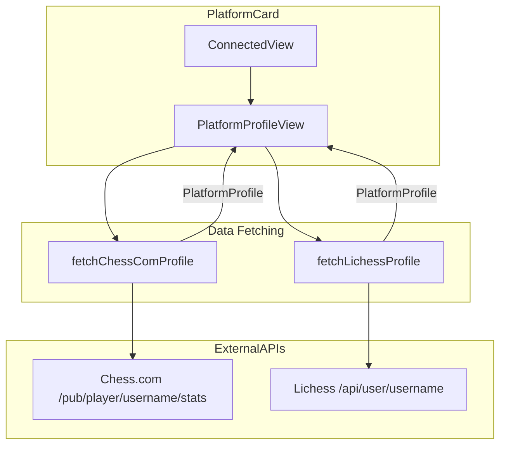
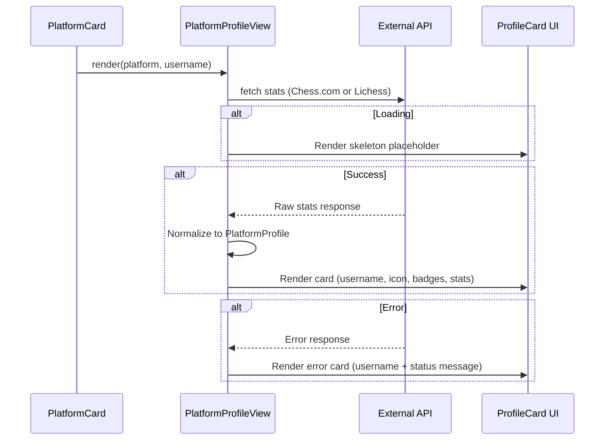

# Design Document: Chess Profile Card

## Overview

The Chess Profile Card redesigns the existing `PlatformProfileView` component into a visually rich, card-based chess profile display. The component renders rating badges per time control, extended game statistics (games played, win/loss/draw record), and a prominent username. Both Chess.com and Lichess profiles share a unified card layout differentiated only by a small platform icon. The component remains embedded inline within the existing `PlatformCard` connected state.

The design extends the `PlatformProfile` and `PlatformRating` types in `lib/account-types.ts` with game statistics, updates the data-fetching logic to extract richer data from Chess.com and Lichess APIs, and rebuilds the presentation layer as a card with badges, stats, and proper loading/error states.

## Architecture



### Data Flow



## Components and Interfaces

### Component 1: PlatformProfileView (Redesigned)

**Purpose**: Top-level component that fetches profile data and delegates rendering to the ProfileCard layout.

```typescript
interface PlatformProfileViewProps {
  platform: Platform;
  username: string;
}
```

**Responsibilities**:
- Fetch profile data from the appropriate platform API on mount
- Manage loading, success, and error states
- Pass normalized `PlatformProfile` data to the card renderer
- Cancel in-flight requests on unmount or prop change

### Component 2: ProfileCard

**Purpose**: Pure presentational component that renders the card layout given a `PlatformProfile`.

```typescript
interface ProfileCardProps {
  profile: PlatformProfile;
}
```

**Responsibilities**:
- Render the card container with rounded border, shadow, and surface-raised background
- Display username prominently
- Render PlatformIcon in the top-right corner
- Render RatingBadges for each time control with rating data
- Render game statistics (games played, W/L/D) for each time control with non-zero games
- Use semantic colors for win/loss/draw values

### Component 3: RatingBadge

**Purpose**: Renders a single pill-shaped chip displaying a time control label and rating value.

```typescript
interface RatingBadgeProps {
  timeControl: string;
  rating: number;
}
```

**Responsibilities**:
- Display time control label (e.g., "Blitz", "Rapid", "Bullet")
- Display numeric rating in monospace font (`font-notation` class)
- Style as rounded pill with `--accent-soft` background

### Component 4: GameStatsRow

**Purpose**: Renders the game statistics for a single time control.

```typescript
interface GameStatsRowProps {
  timeControl: string;
  gamesPlayed: number;
  record: { wins: number; losses: number; draws: number };
}
```

**Responsibilities**:
- Display time control label and total games played
- Display W/L/D record with semantic colors (`--good`, `--danger`, `--ink-muted`)
- Only rendered when `gamesPlayed > 0`

### Component 5: PlatformIcon

**Purpose**: Renders a small platform-identifying icon using lucide-react icons.

```typescript
interface PlatformIconProps {
  platform: Platform;
}
```

**Responsibilities**:
- Render a 16×16 icon that visually identifies Chess.com vs Lichess
- Use a crown/castle icon for Chess.com and a horse/knight icon for Lichess (from lucide-react)

### Component 6: ProfileCardSkeleton

**Purpose**: Renders an animated skeleton placeholder during loading.

```typescript
// No props needed — matches card layout dimensions
```

**Responsibilities**:
- Mirror the ProfileCard layout with animated placeholder blocks
- Respect `prefers-reduced-motion` by disabling animations

### Component 7: ProfileCardError

**Purpose**: Renders the error state while maintaining card styling.

```typescript
interface ProfileCardErrorProps {
  username: string;
  platform: Platform;
}
```

**Responsibilities**:
- Display username and a status message indicating data is unavailable
- Maintain the card container styling (rounded border, shadow, background)
- Show platform icon for context

## Data Models

### Model 1: Extended PlatformRating

```typescript
/** A single rating entry for a time control, extended with game statistics */
export interface PlatformRating {
  timeControl: string;
  rating: number;
  gamesPlayed: number;
  record: {
    wins: number;
    losses: number;
    draws: number;
  };
}
```

**Validation Rules**:
- `rating` must be a positive integer
- `gamesPlayed` must be a non-negative integer
- `record.wins + record.losses + record.draws` should equal `gamesPlayed`
- `wins`, `losses`, `draws` must each be non-negative integers

### Model 2: PlatformProfile (unchanged shape, richer PlatformRating)

```typescript
export interface PlatformProfile {
  username: string;
  platform: Platform;
  ratings: PlatformRating[];
}
```

### Model 3: Chess.com API Response Shape (relevant fields)

```typescript
interface ChessComStatsResponse {
  chess_bullet?: {
    last?: { rating: number };
    record?: { win: number; loss: number; draw: number };
  };
  chess_blitz?: {
    last?: { rating: number };
    record?: { win: number; loss: number; draw: number };
  };
  chess_rapid?: {
    last?: { rating: number };
    record?: { win: number; loss: number; draw: number };
  };
}
```

### Model 4: Lichess API Response Shape (relevant fields)

```typescript
interface LichessUserResponse {
  username: string;
  perfs?: {
    bullet?: { rating: number; games: number };
    blitz?: { rating: number; games: number };
    rapid?: { rating: number; games: number };
  };
  count?: {
    win: number;
    loss: number;
    draw: number;
    all: number;
  };
}
```

**Note on Lichess**: Lichess provides per-time-control game counts via `perfs.{tc}.games` but only provides aggregate W/L/D at the top level (`count.win`, `count.loss`, `count.draw`). Since per-time-control W/L/D is not available from the Lichess user endpoint, the implementation will compute proportional estimates based on the per-time-control game counts relative to total games, or display only total W/L/D. The simpler approach is to use the per-time-control `games` count for `gamesPlayed` and distribute the top-level `count` proportionally.

## Algorithmic Pseudocode

### Chess.com Profile Fetching

```typescript
async function fetchChessComProfile(username: string): Promise<PlatformProfile> {
  const res = await fetch(`https://api.chess.com/pub/player/${username}/stats`);
  if (!res.ok) throw new Error("Failed to fetch Chess.com stats");

  const data: ChessComStatsResponse = await res.json();
  const ratings: PlatformRating[] = [];

  const timeControls = [
    { key: "chess_bullet", label: "Bullet" },
    { key: "chess_blitz", label: "Blitz" },
    { key: "chess_rapid", label: "Rapid" },
  ] as const;

  for (const { key, label } of timeControls) {
    const tc = data[key];
    if (tc?.last?.rating) {
      const record = tc.record ?? { win: 0, loss: 0, draw: 0 };
      const gamesPlayed = record.win + record.loss + record.draw;
      ratings.push({
        timeControl: label,
        rating: tc.last.rating,
        gamesPlayed,
        record: { wins: record.win, losses: record.loss, draws: record.draw },
      });
    }
  }

  return { username, platform: "chesscom", ratings };
}
```

**Preconditions:**
- `username` is a non-empty string
- Network is available

**Postconditions:**
- Returns a `PlatformProfile` with 0–3 ratings entries
- Each rating entry has `gamesPlayed === record.wins + record.losses + record.draws`
- Throws on network failure or non-OK response

### Lichess Profile Fetching

```typescript
async function fetchLichessProfile(username: string): Promise<PlatformProfile> {
  const res = await fetch(`https://lichess.org/api/user/${username}`);
  if (!res.ok) throw new Error("Failed to fetch Lichess profile");

  const data: LichessUserResponse = await res.json();
  const ratings: PlatformRating[] = [];

  const timeControls = [
    { key: "bullet", label: "Bullet" },
    { key: "blitz", label: "Blitz" },
    { key: "rapid", label: "Rapid" },
  ] as const;

  const totalGames = data.count?.all ?? 0;
  const totalWins = data.count?.win ?? 0;
  const totalLosses = data.count?.loss ?? 0;
  const totalDraws = data.count?.draw ?? 0;

  for (const { key, label } of timeControls) {
    const perf = data.perfs?.[key];
    if (perf?.rating) {
      const gamesPlayed = perf.games ?? 0;
      // Proportional W/L/D estimate based on time control's share of total games
      const ratio = totalGames > 0 ? gamesPlayed / totalGames : 0;
      const wins = Math.round(totalWins * ratio);
      const losses = Math.round(totalLosses * ratio);
      const draws = Math.max(0, gamesPlayed - wins - losses);

      ratings.push({
        timeControl: label,
        rating: perf.rating,
        gamesPlayed,
        record: { wins, losses, draws },
      });
    }
  }

  return { username, platform: "lichess", ratings };
}
```

**Preconditions:**
- `username` is a non-empty string
- Network is available

**Postconditions:**
- Returns a `PlatformProfile` with 0–3 ratings entries
- Each rating entry has non-negative `gamesPlayed`, `wins`, `losses`, `draws`
- `wins + losses + draws === gamesPlayed` for each entry
- Throws on network failure or non-OK response

### Normalization Invariant

```typescript
function isValidPlatformRating(rating: PlatformRating): boolean {
  return (
    rating.rating > 0 &&
    rating.gamesPlayed >= 0 &&
    rating.record.wins >= 0 &&
    rating.record.losses >= 0 &&
    rating.record.draws >= 0 &&
    rating.record.wins + rating.record.losses + rating.record.draws === rating.gamesPlayed
  );
}
```

### Filtering Logic

```typescript
// Only render stats for time controls with games > 0
function getDisplayableStats(ratings: PlatformRating[]): PlatformRating[] {
  return ratings.filter(r => r.gamesPlayed > 0);
}

// Only render badges for time controls with rating data
function getDisplayableRatings(ratings: PlatformRating[]): PlatformRating[] {
  return ratings.filter(r => r.rating > 0);
}
```

## Error Handling

### Error Scenario 1: Network Failure

**Condition**: The external API (Chess.com or Lichess) is unreachable or returns a non-OK status.
**Response**: Render `ProfileCardError` with the username and message "Live data unavailable".
**Recovery**: User can disconnect and reconnect the platform to retry.

### Error Scenario 2: Invalid/Unexpected API Response

**Condition**: The API returns OK but the response body doesn't match the expected shape (missing fields, null values).
**Response**: Extract whatever data is available; missing time controls simply don't render. If no data is extractable, treat as an error state.
**Recovery**: Graceful degradation — show available data, omit unavailable sections.

### Error Scenario 3: Username Not Found

**Condition**: The API returns 404 (user doesn't exist on the platform).
**Response**: Render `ProfileCardError` with the username and message "Player not found".
**Recovery**: User should disconnect and re-enter the correct username.

## Component Layout

```
┌─────────────────────────────────────────┐
│  Username                    [Platform]  │  ← card header
├─────────────────────────────────────────┤
│  [Bullet 1234]  [Blitz 1456]  [Rapid …] │  ← rating badges row
├─────────────────────────────────────────┤
│  Bullet · 342 games                      │  ← stats section
│  W 180  L 120  D 42                      │
│                                          │
│  Blitz · 512 games                       │
│  W 260  L 200  D 52                      │
│                                          │
│  Rapid · 89 games                        │
│  W 50   L 30   D 9                       │
└─────────────────────────────────────────┘
```

## Styling Approach

- **Card container**: `rounded-lg border border-[var(--border)] bg-[var(--surface-raised)] shadow-[var(--shadow-card)] p-4`
- **Username**: `text-base font-semibold text-[var(--ink)]`
- **Rating badges**: `inline-flex rounded-full bg-[var(--accent-soft)] px-3 py-1 text-sm text-[var(--ink)]` with rating value in `font-notation`
- **Win color**: `text-[var(--good)]`
- **Loss color**: `text-[var(--danger)]`
- **Draw color**: `text-[var(--ink-muted)]`
- **Platform icon**: 16×16 lucide-react icon (`Crown` for Chess.com, `Baseline` or custom SVG for Lichess)
- **Skeleton**: Uses `animate-pulse` with `motion-safe:` prefix for reduced-motion support
- **Responsive**: Uses `w-full`, percentage-based widths, `flex-wrap` for badge row

## Accessibility

- Card container uses `role="region"` with `aria-label="Chess profile for {username} on {platform}"`
- Rating badges use `aria-label="{timeControl} rating: {rating}"` for screen reader clarity
- Game stats section uses semantic HTML (`<dl>` / `<dt>` / `<dd>`) or `aria-label` attributes
- Color-coded W/L/D values include text labels ("W", "L", "D") so color is not the only indicator
- Skeleton loading state uses `aria-busy="true"` and `aria-label="Loading profile"`

## File Structure

```
components/account/
├── PlatformProfileView.tsx    # Redesigned: fetching + state management
├── ProfileCard.tsx            # New: card layout (success state)
├── ProfileCardSkeleton.tsx    # New: loading skeleton
├── ProfileCardError.tsx       # New: error state card
├── RatingBadge.tsx            # New: pill-shaped rating chip
├── GameStatsRow.tsx           # New: per-time-control stats row
└── PlatformIcon.tsx           # New: platform identification icon

lib/
└── account-types.ts           # Extended PlatformRating type
```

## Correctness Properties

*A property is a characteristic or behavior that should hold true across all valid executions of a system — essentially, a formal statement about what the system should do. Properties serve as the bridge between human-readable specifications and machine-verifiable correctness guarantees.*

### Property 1: Record Sum Invariant

*For any* `PlatformRating` produced by the Chess.com fetcher, the sum `record.wins + record.losses + record.draws` SHALL equal `gamesPlayed`.

**Validates: Requirements 1.1, 1.2, 1.3**

### Property 2: Lichess Record Sum Invariant

*For any* `PlatformRating` produced by the Lichess fetcher, the sum `record.wins + record.losses + record.draws` SHALL equal `gamesPlayed`.

**Validates: Requirements 1.1, 1.2, 1.4**

### Property 3: Badge Count Matches Available Ratings

*For any* `PlatformProfile` with N time controls that have a positive rating value, the ProfileCard SHALL render exactly N RatingBadge elements.

**Validates: Requirements 2.4**

### Property 4: Zero-Games Filtering

*For any* `PlatformProfile` where a time control has `gamesPlayed === 0`, that time control SHALL NOT appear in the rendered statistics section.

**Validates: Requirements 4.4**

### Property 5: Rating Badge Content Completeness

*For any* rendered RatingBadge, the output SHALL contain both the time control label string and the numeric rating value string.

**Validates: Requirements 3.1**

### Property 6: Game Stats Content Completeness

*For any* rendered GameStatsRow with `gamesPlayed > 0`, the output SHALL contain the games-played count and all three W/L/D numeric values.

**Validates: Requirements 4.1, 4.2**

### Property 7: Error State Preserves Username

*For any* username string and any API failure condition, the error state SHALL render the original username within the card.

**Validates: Requirements 6.2**

### Property 8: Non-Negative Statistics

*For any* `PlatformRating` produced by either fetcher, all numeric fields (`rating`, `gamesPlayed`, `record.wins`, `record.losses`, `record.draws`) SHALL be non-negative.

**Validates: Requirements 1.1, 1.2, 1.5**

### Property 9: Accessible Labels Present

*For any* successfully rendered ProfileCard, the component SHALL include an ARIA label or semantic element conveying the username, and each RatingBadge SHALL have an accessible label containing both time control and rating value.

**Validates: Requirements 7.2**


## Testing Strategy

### Unit Testing Approach

- **Fetcher normalization**: Test Chess.com and Lichess fetchers with mocked API responses covering various shapes (missing fields, zero games, partial data)
- **Filtering logic**: Verify `getDisplayableStats` and `getDisplayableRatings` with edge cases (empty array, all zeros, mixed)
- **Component rendering**: Test ProfileCard, RatingBadge, GameStatsRow with specific profiles using React Testing Library
- **Error state**: Verify ProfileCardError renders username and maintains card styling
- **Loading state**: Verify skeleton renders and respects reduced-motion

### Property-Based Testing Approach

**Property Test Library**: fast-check

- **Record sum invariant**: For any Chess.com response shape, `wins + losses + draws === gamesPlayed`
- **Lichess record sum**: For any Lichess response shape, the proportional calculation maintains `wins + losses + draws === gamesPlayed`
- **Badge count**: For any profile with N rated time controls, exactly N badges render
- **Zero-games filtering**: For any profile, time controls with zero games never appear in stats
- **Non-negative stats**: For any API response, all extracted numeric fields are non-negative
- **Error state username**: For any username string, the error state always contains it

### Integration Testing Approach

- **Live API smoke test** (manual): Connect a real Chess.com/Lichess account and verify the card renders correctly
- **PlatformCard integration**: Verify PlatformProfileView integrates correctly within PlatformCard's ConnectedView
- **Dark mode**: Visual regression check that CSS variables produce correct colors in both themes
