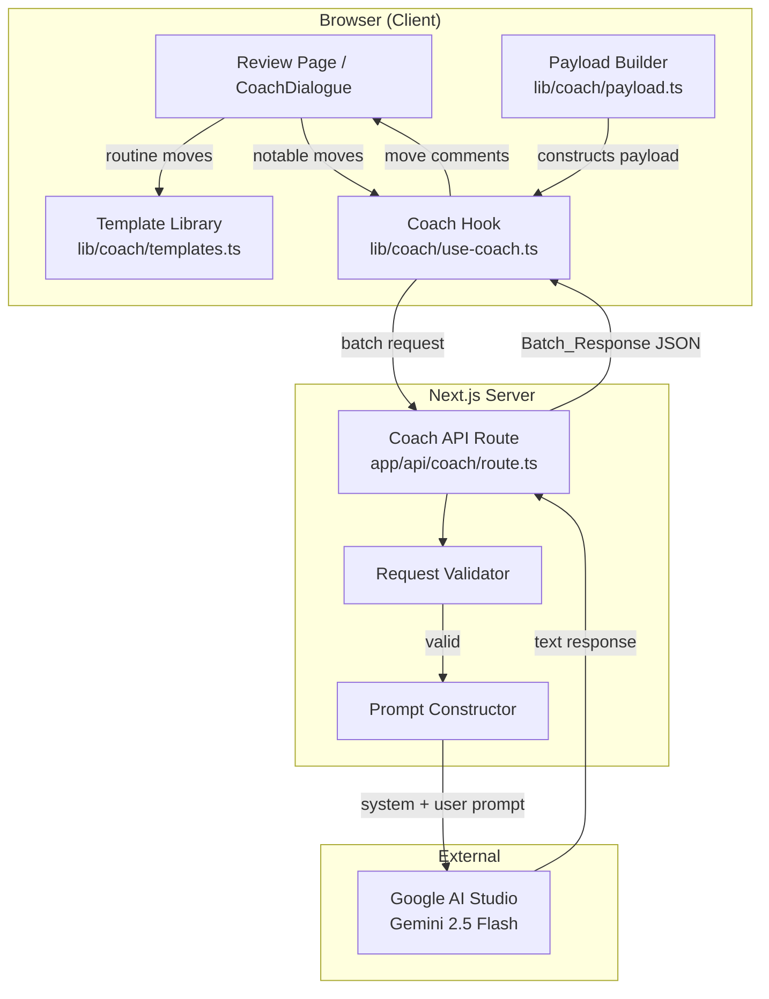
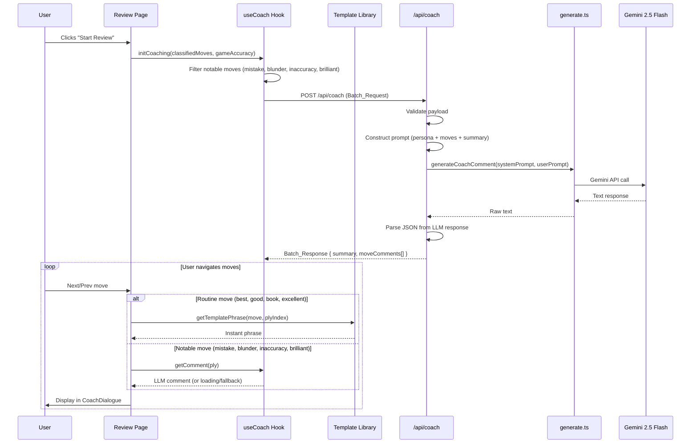

# Design Document: LLM Coaching

## Overview

This feature upgrades Toby's coaching system from a purely rule-based template approach to a hybrid model. Routine moves (best, good, book, excellent) continue receiving instant client-side commentary from a structured template library. Notable moves (mistake, blunder, inaccuracy, brilliant) are batched into a single LLM API call per game review, returning personalized, position-grounded commentary in Toby's voice.

The architecture introduces a thin server-side layer (a Next.js API route) that acts as a proxy between the client and Google AI Studio (Gemini 2.5 Flash). The client constructs the batch payload from existing classified move data, sends one request when review begins, and displays LLM-generated comments as the user navigates. The existing `lib/coaching.ts` template system is refactored into a new `lib/coach/templates.ts` module with a cleaner interpolation interface, while the original module's phrase banks inform the new library's content.

Key design goals:
- **One API call per game** — all notable moves batched together to stay within the free-tier rate limit (1,500 req/day)
- **Instant routine feedback** — template phrases render synchronously with zero network dependency
- **Graceful degradation** — if the LLM call fails, notable moves fall back to template phrases
- **Provider swappability** — all LLM details isolated in a single `generate.ts` module

## Architecture



### Data Flow



## Components and Interfaces

### Component 1: Template Library (`lib/coach/templates.ts`)

**Purpose**: Provides instant, deterministic coaching phrases for routine moves. Replaces the existing `lib/coaching.ts` with a cleaner structure that separates template selection from interpolation.

```typescript
/** Input data needed to generate a template phrase. */
interface TemplateMoveInput {
  san: string;           // e.g., "Nf3"
  color: "white" | "black";
  moveNumber: number;    // Full move number (1-based)
  grade: RoutineGrade;
  ply: number;           // Zero-based half-move index (used as selection seed)
}

type RoutineGrade = "best" | "good" | "book" | "excellent";
type NotableGrade = "mistake" | "blunder" | "inaccuracy" | "brilliant";

/**
 * Returns a coaching phrase for a routine move.
 * Selection is deterministic: same ply always produces the same phrase.
 */
function getTemplatePhrase(input: TemplateMoveInput): string;

/**
 * Returns a fallback phrase for a notable move when LLM is unavailable.
 * Uses the same template bank structure but with notable-grade templates.
 */
function getFallbackPhrase(input: Omit<TemplateMoveInput, "grade"> & { grade: NotableGrade }): string;
```

**Responsibilities**:
- Store ≥3 phrase variants per grade (routine and notable)
- Select deterministically using `ply % variants.length`
- Interpolate move data (SAN, move number, color) into phrases
- Conform all output to Toby persona voice rules

### Component 2: LLM Provider Abstraction (`lib/coach/generate.ts`)

**Purpose**: Encapsulates all Google AI Studio / Gemini SDK details so the provider can be swapped without touching route logic.

```typescript
/**
 * Sends a prompt to the configured LLM provider and returns the text response.
 * Throws if the API key is missing or the provider returns an error.
 */
async function generateCoachComment(
  systemPrompt: string,
  userPrompt: string
): Promise<string>;
```

**Responsibilities**:
- Initialize the Google Generative AI SDK with `GOOGLE_AI_API_KEY`
- Use model `gemini-2.5-flash`
- Pass system prompt and user prompt to the model
- Return the generated text content
- Throw descriptive errors for missing API key or provider failures
- No retry logic (let the route handle error responses)

### Component 3: Coach API Route (`app/api/coach/route.ts`)

**Purpose**: Next.js App Router POST endpoint that validates the batch request, constructs the LLM prompt, calls the provider, parses the response, and returns structured JSON.

```typescript
/** POST /api/coach */
async function POST(request: Request): Promise<Response>;
```

**Responsibilities**:
- Validate `BatchRequest` payload (400 on failure)
- Construct system prompt from Toby persona
- Construct user prompt from notable moves + game summary
- Call `generateCoachComment` (exactly one call per request)
- Parse LLM text response into `BatchResponse` JSON structure
- Return 200 with `BatchResponse` on success
- Return 502 on LLM error or unparseable response
- Handle zero-notable-moves edge case (return empty moveComments + generic summary)

### Component 4: Payload Builder (`lib/coach/payload.ts`)

**Purpose**: Client-side utility that constructs a valid `BatchRequest` from classified moves and game accuracy data.

```typescript
/**
 * Builds the batch request payload from review state.
 * Filters notable moves and extracts game summary fields.
 */
function buildBatchRequest(
  classifiedMoves: ClassifiedMove[],
  gameAccuracy: GameAccuracy,
  headers: PGNHeaders,
  playerColor: "white" | "black"
): BatchRequest;
```

**Responsibilities**:
- Filter classified moves to only notable grades (mistake, blunder, inaccuracy, brilliant)
- Extract required fields per move: ply, san, grade, winPercentLoss, bestMove
- Assemble game summary from accuracy data and PGN headers
- Return a typed `BatchRequest` ready for `fetch()`

### Component 5: Coach Hook (`lib/coach/use-coach.ts`)

**Purpose**: React hook that manages the LLM coaching lifecycle — fires the batch request when review starts, exposes loading/error/data state.

```typescript
interface UseCoachResult {
  /** Loading state for the batch request */
  status: "idle" | "loading" | "ready" | "error";
  /** LLM-generated game summary (null until ready) */
  gameSummary: string | null;
  /** Get the LLM comment for a specific ply (null if not a notable move) */
  getComment(ply: number): string | null;
  /** Trigger the batch request */
  fetchCoaching(
    classifiedMoves: ClassifiedMove[],
    gameAccuracy: GameAccuracy,
    headers: PGNHeaders,
    playerColor: "white" | "black"
  ): void;
}

function useCoach(): UseCoachResult;
```

**Responsibilities**:
- Fire a single POST to `/api/coach` when `fetchCoaching` is called
- Store `moveComments` in a Map keyed by ply for O(1) lookup
- Expose loading/error/ready status
- Provide `getComment(ply)` for the UI to retrieve per-move text
- Handle abort on unmount (AbortController)

### Component 6: Updated CoachDialogue

**Purpose**: Extended version of the existing `CoachDialogue` component that integrates both template and LLM coaching sources, plus a loading skeleton state.

The existing `CoachDialogue` component already handles text display, grade accent, step navigation, and exit controls. The updates add:
- A `loading` boolean prop to show a skeleton state
- Source awareness: the parent decides whether to pass template text or LLM text

```typescript
interface CoachDialogueProps {
  text: string;
  grade?: MoveGrade | null;
  step: number;
  totalSteps: number;
  onPrev: () => void;
  onNext: () => void;
  onExit: () => void;
  canPrev: boolean;
  canNext: boolean;
  /** When true, display a loading skeleton instead of text */
  loading?: boolean;
}
```

## Data Models

### Model 1: BatchRequest

```typescript
interface BatchRequest {
  notableMoves: NotableMovePayload[];
  gameSummary: GameSummaryPayload;
  playerColor: "white" | "black";
}

interface NotableMovePayload {
  ply: number;
  san: string;
  grade: "mistake" | "blunder" | "inaccuracy" | "brilliant";
  winPercentLoss: number;
  bestMove: string;  // UCI notation, e.g. "e2e4"
}

interface GameSummaryPayload {
  whiteName: string;
  blackName: string;
  openingName: string;
  whiteAccuracy: number;
  blackAccuracy: number;
  result: string;  // "1-0" | "0-1" | "1/2-1/2"
}
```

**Validation Rules**:
- `notableMoves` may be empty (zero notable moves is valid)
- Each `NotableMovePayload.ply` must be a non-negative integer
- Each `NotableMovePayload.san` must be a non-empty string
- Each `NotableMovePayload.grade` must be one of the four notable grades
- Each `NotableMovePayload.winPercentLoss` must be a non-negative number
- Each `NotableMovePayload.bestMove` must be a non-empty string (4-5 chars, UCI format)
- `gameSummary` fields must all be present and non-empty strings / non-negative numbers
- `playerColor` must be exactly `"white"` or `"black"`

### Model 2: BatchResponse

```typescript
interface BatchResponse {
  summary: string;
  moveComments: MoveComment[];
}

interface MoveComment {
  ply: number;
  comment: string;
}
```

**Invariants**:
- `summary` is always a non-empty string (1-3 sentences)
- `moveComments.length === request.notableMoves.length`
- Each `moveComments[i].ply` matches the corresponding `notableMoves[i].ply`
- Each `comment` is 1-3 sentences conforming to Toby persona rules

### Model 3: Coach State (client-side)

```typescript
interface CoachState {
  status: "idle" | "loading" | "ready" | "error";
  gameSummary: string | null;
  moveComments: Map<number, string>;  // ply → comment
  error: string | null;
}
```

## Algorithmic Pseudocode

### Template Phrase Selection

```typescript
function getTemplatePhrase(input: TemplateMoveInput): string {
  const templates = TEMPLATE_BANK[input.grade]; // string[] with ≥3 entries
  const index = ((input.ply % templates.length) + templates.length) % templates.length;
  const template = templates[index];
  return interpolate(template, {
    san: input.san,
    moveLabel: formatMoveLabel(input.moveNumber, input.color, input.san),
    side: input.color === "white" ? "White" : "Black",
  });
}

function interpolate(template: string, vars: Record<string, string>): string {
  return template.replace(/\{(\w+)\}/g, (_, key) => vars[key] ?? "");
}

function formatMoveLabel(moveNumber: number, color: "white" | "black", san: string): string {
  const dots = color === "white" ? "." : "...";
  return `${moveNumber}${dots} ${san}`;
}
```

**Preconditions**:
- `input.grade` is a valid routine grade key in `TEMPLATE_BANK`
- `TEMPLATE_BANK[grade].length >= 3`
- `input.ply >= 0`

**Postconditions**:
- Returns a non-empty string
- Same `input.ply` and `input.grade` always returns the same string (deterministic)
- Output contains interpolated move data

### Payload Construction

```typescript
function buildBatchRequest(
  classifiedMoves: ClassifiedMove[],
  gameAccuracy: GameAccuracy,
  headers: PGNHeaders,
  playerColor: "white" | "black"
): BatchRequest {
  const notableGrades = new Set(["mistake", "blunder", "inaccuracy", "brilliant"]);

  const notableMoves: NotableMovePayload[] = classifiedMoves
    .filter((m) => notableGrades.has(m.grade))
    .map((m, _i, _arr) => ({
      ply: classifiedMoves.indexOf(m),  // zero-based half-move index
      san: m.san,
      grade: m.grade as NotableMovePayload["grade"],
      winPercentLoss: m.winPercentLoss,
      bestMove: m.bestMove,
    }));

  const gameSummary: GameSummaryPayload = {
    whiteName: headers.white,
    blackName: headers.black,
    openingName: gameAccuracy.opening.name,
    whiteAccuracy: gameAccuracy.white.accuracy,
    blackAccuracy: gameAccuracy.black.accuracy,
    result: headers.result,
  };

  return { notableMoves, gameSummary, playerColor };
}
```

**Preconditions**:
- `classifiedMoves` is a non-empty array of fully classified moves
- `gameAccuracy` contains valid accuracy data
- `headers` has white, black, and result fields

**Postconditions**:
- `notableMoves` contains only moves with notable grades
- Each payload entry has all required fields populated
- `gameSummary` has all required fields from accuracy + headers

### Prompt Construction

```typescript
function buildSystemPrompt(): string {
  // The full TOBY_PERSONA.MD content serves as the system prompt,
  // plus an additional instruction block for JSON output format.
  return `${TOBY_PERSONA_CONTENT}

## Output Format Instructions
You will receive a set of notable chess moves with analysis data.
Respond with ONLY a valid JSON object matching this structure:
{
  "summary": "<1-3 sentence game overview grounded in the accuracy data>",
  "moveComments": [
    { "ply": <number>, "comment": "<1-3 sentence coaching remark>" }
  ]
}
Rules:
- Produce exactly one entry in moveComments for each notable move provided.
- Each comment must reference the specific move and position data given.
- Follow all Toby voice rules: 1-3 sentences, sentence case, no emoji.
- Never fabricate analysis not present in the supplied data.`;
}

function buildUserPrompt(request: BatchRequest): string {
  const { notableMoves, gameSummary, playerColor } = request;

  let prompt = `## Game Summary\n`;
  prompt += `White: ${gameSummary.whiteName} (accuracy: ${gameSummary.whiteAccuracy.toFixed(1)}%)\n`;
  prompt += `Black: ${gameSummary.blackName} (accuracy: ${gameSummary.blackAccuracy.toFixed(1)}%)\n`;
  prompt += `Opening: ${gameSummary.openingName}\n`;
  prompt += `Result: ${gameSummary.result}\n`;
  prompt += `Reviewing player: ${playerColor}\n\n`;

  prompt += `## Notable Moves\n`;
  for (const move of notableMoves) {
    prompt += `- Ply ${move.ply}: ${move.san} [${move.grade}] `;
    prompt += `(win% loss: ${move.winPercentLoss.toFixed(1)}, `;
    prompt += `engine best: ${move.bestMove})\n`;
  }

  return prompt;
}
```

**Preconditions**:
- `TOBY_PERSONA_CONTENT` is the full text of TOBY_PERSONA.MD
- `request` is a valid `BatchRequest`

**Postconditions**:
- System prompt contains persona rules + JSON format instructions
- User prompt contains all move fields (ply, SAN, grade, winPercentLoss, bestMove)
- User prompt contains all summary fields (names, opening, accuracies, result, playerColor)

### Route Handler

```typescript
async function POST(request: Request): Promise<Response> {
  // 1. Parse and validate request body
  const body = await request.json();
  const validation = validateBatchRequest(body);
  if (!validation.ok) {
    return Response.json({ error: validation.error }, { status: 400 });
  }
  const batchRequest: BatchRequest = validation.data;

  // 2. Handle zero notable moves edge case
  if (batchRequest.notableMoves.length === 0) {
    return Response.json({
      summary: "A clean game with no major turning points — steady play throughout.",
      moveComments: [],
    });
  }

  // 3. Build prompts
  const systemPrompt = buildSystemPrompt();
  const userPrompt = buildUserPrompt(batchRequest);

  // 4. Call LLM (exactly one call)
  let rawResponse: string;
  try {
    rawResponse = await generateCoachComment(systemPrompt, userPrompt);
  } catch (err) {
    return Response.json(
      { error: `LLM service error: ${err instanceof Error ? err.message : "unknown"}` },
      { status: 502 }
    );
  }

  // 5. Parse LLM response as JSON
  let parsed: BatchResponse;
  try {
    parsed = parseLLMResponse(rawResponse, batchRequest.notableMoves.length);
  } catch (err) {
    return Response.json(
      { error: `Failed to parse LLM response: ${err instanceof Error ? err.message : "unknown"}` },
      { status: 502 }
    );
  }

  return Response.json(parsed);
}
```

**Preconditions**:
- Request is a valid HTTP POST with JSON body
- `GOOGLE_AI_API_KEY` environment variable is set

**Postconditions**:
- Returns 200 with `BatchResponse` on success
- Returns 400 with error description on validation failure
- Returns 502 on LLM error or response parse failure
- Exactly one LLM call is made per successful request

### LLM Response Parsing

```typescript
function parseLLMResponse(raw: string, expectedCount: number): BatchResponse {
  // Strip markdown code fences if present (LLMs often wrap JSON in ```json...```)
  const cleaned = raw.replace(/^```(?:json)?\s*\n?/m, "").replace(/\n?```\s*$/m, "").trim();

  const parsed = JSON.parse(cleaned);

  // Validate structure
  if (typeof parsed.summary !== "string" || !parsed.summary.trim()) {
    throw new Error("Missing or empty 'summary' field");
  }
  if (!Array.isArray(parsed.moveComments)) {
    throw new Error("Missing 'moveComments' array");
  }
  if (parsed.moveComments.length !== expectedCount) {
    throw new Error(
      `Expected ${expectedCount} move comments, got ${parsed.moveComments.length}`
    );
  }
  for (const mc of parsed.moveComments) {
    if (typeof mc.ply !== "number" || typeof mc.comment !== "string" || !mc.comment.trim()) {
      throw new Error("Invalid moveComment entry: requires ply (number) and comment (non-empty string)");
    }
  }

  return {
    summary: parsed.summary.trim(),
    moveComments: parsed.moveComments.map((mc: { ply: number; comment: string }) => ({
      ply: mc.ply,
      comment: mc.comment.trim(),
    })),
  };
}
```

**Preconditions**:
- `raw` is the string response from the LLM
- `expectedCount >= 0`

**Postconditions**:
- Returns a valid `BatchResponse` with `moveComments.length === expectedCount`
- All strings are trimmed
- Throws on any structural issue (missing fields, wrong count, empty comments)

### Request Validation

```typescript
interface ValidationResult<T> {
  ok: true; data: T;
} | {
  ok: false; error: string;
}

function validateBatchRequest(body: unknown): ValidationResult<BatchRequest> {
  // Type-check top-level shape
  if (!body || typeof body !== "object") return { ok: false, error: "Body must be a JSON object" };

  const { notableMoves, gameSummary, playerColor } = body as Record<string, unknown>;

  // playerColor
  if (playerColor !== "white" && playerColor !== "black") {
    return { ok: false, error: "playerColor must be 'white' or 'black'" };
  }

  // notableMoves array
  if (!Array.isArray(notableMoves)) {
    return { ok: false, error: "notableMoves must be an array" };
  }

  const validGrades = new Set(["mistake", "blunder", "inaccuracy", "brilliant"]);
  for (let i = 0; i < notableMoves.length; i++) {
    const m = notableMoves[i];
    if (typeof m.ply !== "number" || m.ply < 0) return { ok: false, error: `notableMoves[${i}].ply must be a non-negative number` };
    if (typeof m.san !== "string" || !m.san) return { ok: false, error: `notableMoves[${i}].san must be a non-empty string` };
    if (!validGrades.has(m.grade)) return { ok: false, error: `notableMoves[${i}].grade must be mistake|blunder|inaccuracy|brilliant` };
    if (typeof m.winPercentLoss !== "number" || m.winPercentLoss < 0) return { ok: false, error: `notableMoves[${i}].winPercentLoss must be a non-negative number` };
    if (typeof m.bestMove !== "string" || !m.bestMove) return { ok: false, error: `notableMoves[${i}].bestMove must be a non-empty string` };
  }

  // gameSummary
  if (!gameSummary || typeof gameSummary !== "object") return { ok: false, error: "gameSummary must be an object" };
  const gs = gameSummary as Record<string, unknown>;
  if (typeof gs.whiteName !== "string" || !gs.whiteName) return { ok: false, error: "gameSummary.whiteName required" };
  if (typeof gs.blackName !== "string" || !gs.blackName) return { ok: false, error: "gameSummary.blackName required" };
  if (typeof gs.openingName !== "string" || !gs.openingName) return { ok: false, error: "gameSummary.openingName required" };
  if (typeof gs.whiteAccuracy !== "number" || gs.whiteAccuracy < 0) return { ok: false, error: "gameSummary.whiteAccuracy required" };
  if (typeof gs.blackAccuracy !== "number" || gs.blackAccuracy < 0) return { ok: false, error: "gameSummary.blackAccuracy required" };
  if (typeof gs.result !== "string" || !gs.result) return { ok: false, error: "gameSummary.result required" };

  return { ok: true, data: body as BatchRequest };
}
```

## Correctness Properties

*A property is a characteristic or behavior that should hold true across all valid executions of a system — essentially, a formal statement about what the system should do. Properties serve as the bridge between human-readable specifications and machine-verifiable correctness guarantees.*

### Property 1: Template Output Validity

*For any* valid `TemplateMoveInput` (any routine grade, any non-negative ply, any valid SAN, any color, any move number), the template library SHALL return a string that is 1–3 sentences long, contains no emoji characters, and includes the move's SAN notation or formatted move label.

**Validates: Requirements 1.1, 1.4, 1.5**

### Property 2: Template Selection Determinism

*For any* `TemplateMoveInput`, calling `getTemplatePhrase` twice with identical inputs SHALL return the same string.

**Validates: Requirements 1.3**

### Property 3: Single LLM Call Per Batch

*For any* valid `BatchRequest` containing 1 to N notable moves, the Coach API Route SHALL invoke the `generateCoachComment` function exactly once.

**Validates: Requirements 2.2**

### Property 4: Response Schema Conformance

*For any* valid `BatchRequest` that produces a successful response, the returned JSON SHALL contain a `summary` field (non-empty string) and a `moveComments` field (array where each element has `ply` as a number and `comment` as a non-empty string).

**Validates: Requirements 2.3, 8.1, 8.2**

### Property 5: Response Comment Cardinality

*For any* valid `BatchRequest` with N notable moves that produces a successful response, the `moveComments` array in the response SHALL contain exactly N entries, one per notable move.

**Validates: Requirements 8.3**

### Property 6: Invalid Request Rejection

*For any* `BatchRequest` payload where a notable move is missing one or more required fields (ply, san, grade, winPercentLoss, bestMove), the Coach API Route SHALL return HTTP 400 with a descriptive error message.

**Validates: Requirements 2.7, 2.8**

### Property 7: Prompt Completeness for Notable Moves

*For any* set of notable moves in a valid `BatchRequest`, the constructed user prompt string SHALL contain each move's ply number, SAN notation, grade, win-percentage loss value, and engine best move in UCI notation.

**Validates: Requirements 4.2**

### Property 8: Batch Request Payload Completeness

*For any* array of `ClassifiedMove` objects containing notable grades and any valid `GameAccuracy` and `PGNHeaders`, the `buildBatchRequest` function SHALL produce a payload where every notable move entry has all required fields (ply, san, grade, winPercentLoss, bestMove) and the gameSummary has all required fields (whiteName, blackName, openingName, whiteAccuracy, blackAccuracy, result).

**Validates: Requirements 7.1, 7.2**

### Property 9: Routine Moves Render Without Loading

*For any* routine move (best, good, book, excellent) encountered during the coaching walkthrough, the UI SHALL display text content without a loading skeleton, regardless of the LLM batch request status.

**Validates: Requirements 5.1**

### Property 10: Correct Comment Displayed for Ply

*For any* `BatchResponse` containing move comments and any ply value that exists in the `moveComments` array, the `getComment(ply)` function SHALL return the comment string matching that specific ply.

**Validates: Requirements 6.3**

## Error Handling

### Error Scenario 1: Missing API Key

**Condition**: `GOOGLE_AI_API_KEY` environment variable is not set or empty.
**Response**: `generateCoachComment` throws an error with message "GOOGLE_AI_API_KEY environment variable is not configured". The route catches this and returns 502.
**Recovery**: Developer must set the environment variable. Client falls back to template phrases for notable moves.

### Error Scenario 2: LLM Provider Timeout / Network Failure

**Condition**: Google AI Studio is unreachable or responds after a timeout (30s default).
**Response**: The route returns HTTP 502 with `{ error: "LLM service error: <message>" }`. The client hook transitions to `status: "error"`.
**Recovery**: CoachDialogue falls back to template phrases for notable moves. The game summary retains the existing rule-based comment. No automatic retry — the user can restart the review if desired.

### Error Scenario 3: LLM Returns Malformed JSON

**Condition**: The LLM response is not valid JSON or doesn't match the expected schema (missing fields, wrong count of comments).
**Response**: `parseLLMResponse` throws, route returns HTTP 502 with `{ error: "Failed to parse LLM response: <details>" }`.
**Recovery**: Same fallback as Scenario 2 — template phrases used for all moves.

### Error Scenario 4: LLM Returns Wrong Number of Comments

**Condition**: The LLM returns a valid JSON array but with fewer or more comments than the number of notable moves sent.
**Response**: `parseLLMResponse` throws with "Expected N move comments, got M".
**Recovery**: Route returns 502. Client falls back to templates.

### Error Scenario 5: Rate Limit Exceeded (Free Tier)

**Condition**: Google AI Studio free tier limit (1,500 req/day) is exceeded.
**Response**: The provider SDK will throw a rate-limit error. Route returns 502 with the error message.
**Recovery**: Template fallback. The feature degrades gracefully — users still get rule-based commentary. No queuing or retry mechanism at this stage.

### Error Scenario 6: Invalid Request Payload

**Condition**: Client sends a malformed payload (missing fields, wrong types, invalid grades).
**Response**: Route returns HTTP 400 with `{ error: "<specific validation failure message>" }`.
**Recovery**: This indicates a client bug. The hook transitions to error state and templates are used as fallback.

### Error Scenario 7: Zero Notable Moves

**Condition**: The game has no mistakes, blunders, inaccuracies, or brilliant moves.
**Response**: Route returns 200 with `{ summary: "A clean game...", moveComments: [] }`. No LLM call is made.
**Recovery**: Not an error — all moves are routine and get template phrases. The generic summary is displayed.

## Testing Strategy

### Property-Based Testing

**Library**: fast-check (already in devDependencies)

Property-based tests validate universal correctness guarantees with ≥100 random iterations each.

| Property | Test Description | Key Generators |
|----------|-----------------|----------------|
| 1: Template Output Validity | Generate random routine grades, plys, SAN strings, colors, move numbers → verify output is 1-3 sentences, no emoji, contains move data | `fc.constantFrom("best","good","book","excellent")`, `fc.nat()`, `fc.stringMatching(/[KQRBN]?[a-h]?[1-8]?x?[a-h][1-8][+#]?/)` |
| 2: Template Determinism | Call `getTemplatePhrase` twice with same generated input → assert equality | Same as above |
| 3: Single LLM Call | Generate valid BatchRequests with 1-10 moves, mock `generateCoachComment`, count calls → assert 1 | `fc.array(notableMoveArb, {minLength:1, maxLength:10})` |
| 5: Response Comment Cardinality | Generate N notable moves, mock LLM to return N comments → verify response has N entries | `fc.integer({min:1, max:15})` for count |
| 6: Invalid Request Rejection | Generate payloads with one field removed/corrupted → verify 400 | Custom shrinker removing fields |
| 7: Prompt Completeness | Generate notable moves, build prompt → verify all field values appear in prompt string | Notable move arbitrary |
| 8: Payload Completeness | Generate ClassifiedMove arrays with notable grades → verify all fields extracted | ClassifiedMove arbitrary |
| 10: Correct Comment for Ply | Generate Map<ply, comment>, query random ply → verify correct comment returned | `fc.array(fc.tuple(fc.nat(), fc.string()))` |

**Configuration**: Each property test runs a minimum of 100 iterations.
**Tag format**: `// Feature: llm-coaching, Property N: <description>`

### Unit Testing

Unit tests cover specific examples, edge cases, and integration points:

- **Template Library**:
  - Each grade has ≥3 variants (structural check)
  - Interpolation produces expected output for known inputs
  - Edge case: ply=0, very long SAN, move number > 100

- **Payload Builder**:
  - Filters only notable grades from mixed classified moves
  - Handles game with zero notable moves (returns empty array)
  - Preserves field accuracy (no rounding errors on winPercentLoss)

- **Request Validator**:
  - Accepts valid minimal payload
  - Rejects each missing field individually (7 cases)
  - Rejects invalid grade values
  - Rejects negative ply / winPercentLoss

- **LLM Response Parser**:
  - Handles clean JSON
  - Handles JSON wrapped in markdown code fences
  - Rejects wrong comment count
  - Rejects missing/empty fields
  - Trims whitespace from comments

- **Prompt Constructor**:
  - Includes all persona content in system prompt
  - Includes JSON format instructions
  - User prompt contains all move fields for 1 move, 5 moves, 10 moves

### Integration Testing

- **Route end-to-end** (mocked LLM): Send valid request → verify 200 + correct schema
- **Route error paths**: Mock LLM throw → verify 502; send invalid body → verify 400
- **Hook lifecycle**: Mount hook, fire fetch, resolve mock → verify status transitions idle→loading→ready
- **Hook abort**: Unmount during fetch → verify no state update / no error
- **UI integration**: Render review page with mocked hook → verify template phrases for routine moves, LLM text for notable moves, skeleton during loading

## File Structure

```
lib/coach/
├── templates.ts       # Template library — canned phrases per grade, deterministic selection
├── generate.ts        # LLM provider abstraction — encapsulates Gemini SDK
├── payload.ts         # Client-side payload builder (ClassifiedMoves → BatchRequest)
├── prompt.ts          # Prompt construction (system + user prompt builders)
├── parse-response.ts  # LLM response parser + validation
├── validate.ts        # BatchRequest schema validation (used by route)
├── use-coach.ts       # React hook — manages batch fetch lifecycle
└── types.ts           # Shared types: BatchRequest, BatchResponse, MoveComment, etc.

app/api/coach/
└── route.ts           # Next.js API route handler (POST)
```

The existing `lib/coaching.ts` remains available during migration but is superseded by `lib/coach/templates.ts` for the review walkthrough. The new module reuses phrase content from the original but with a cleaner interpolation interface.

## Dependencies

| Package | Purpose | Notes |
|---------|---------|-------|
| `@google/generative-ai` | Google AI Studio SDK | Gemini 2.5 Flash access |
| `fast-check` | Property-based testing | Already in devDependencies |

**Environment Variables**:
- `GOOGLE_AI_API_KEY` — Google AI Studio API key (free tier, no credit card)

## Performance Considerations

- **Single batch call**: All notable moves for a game are sent in one request, avoiding per-move latency and staying within rate limits.
- **Template phrases are synchronous**: No network call, no async rendering — instant display for routine moves.
- **LLM response caching**: The hook stores comments in a Map; navigating back to a notable move is O(1) lookup with no re-fetch.
- **Abort on unmount**: If the user leaves the review page before the batch resolves, the fetch is aborted to avoid wasted resources.
- **Payload size**: A typical game has 3-8 notable moves. The request payload is small (~1-2KB) and the response is similarly compact.
- **Free tier budget**: At 1,500 req/day, each game review costs 1 request. This supports ~1,500 game reviews per day per API key.

## Security Considerations

- **API key server-side only**: `GOOGLE_AI_API_KEY` is only accessed in the API route (server-side). It is never exposed to the client bundle.
- **Input sanitization**: The route validates all input fields before constructing the prompt. No user-provided text is passed to the LLM without validation.
- **Prompt injection mitigation**: Move data (SAN, UCI) is structural chess notation with limited vocabulary. The game summary fields (player names, opening names) come from PGN headers which are short strings. The prompt structure separates system instructions from user data clearly.
- **No PII storage**: The route is stateless — no game data or LLM responses are persisted server-side.
- **Rate limiting**: The free tier's 1,500 req/day limit provides natural rate limiting. Additional application-level rate limiting can be added later if needed.

