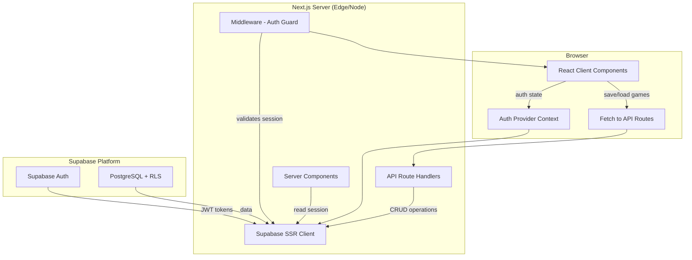
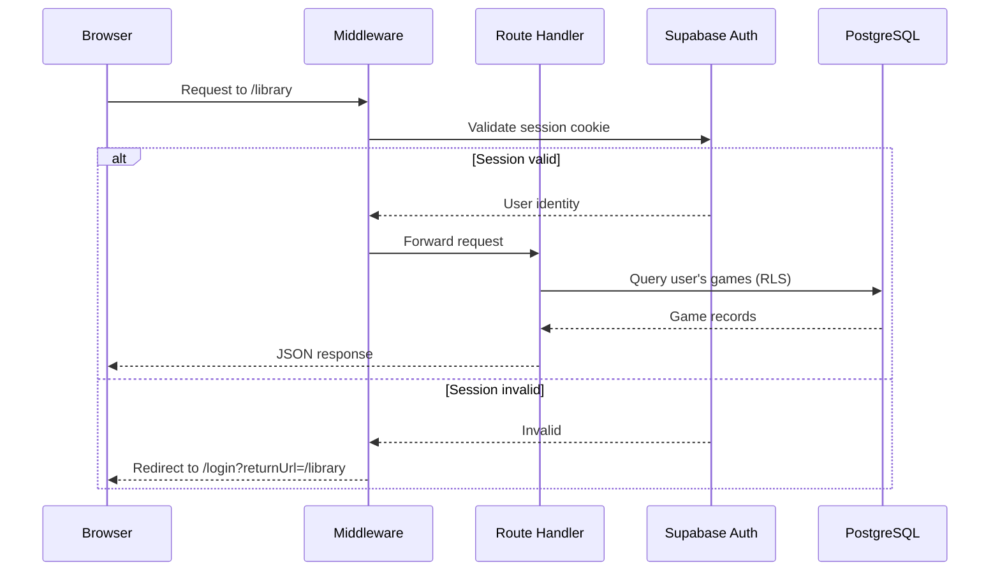

# Design Document: User Auth and Database

## Overview

This design introduces server-side functionality to Toby — a previously client-only chess game review app — by adding user authentication, session management, a PostgreSQL database for user profiles and saved games, route protection, and CRUD API routes for game library management. The implementation leverages Supabase (Auth + PostgreSQL + Row-Level Security) integrated with Next.js 16 App Router via Supabase SSR helpers.

### Design Goals

- **Minimal disruption**: The existing client-side analysis workflow (import → parse → analyze → classify → present) remains fully functional for anonymous users.
- **Security-first**: HTTP-only cookies for sessions, RLS for data isolation, bcrypt password hashing (Supabase default), and server-side validation on all mutations.
- **Progressive enhancement**: Unauthenticated users get the full review experience; authentication unlocks persistence (save/load games).
- **Consistency with existing UX**: Auth UI follows Toby's warm, minimal visual identity.

### Key Dependencies (New)

| Package | Purpose |
|---------|---------|
| `@supabase/supabase-js` | Supabase client SDK |
| `@supabase/ssr` | Server-side cookie-based session helpers for Next.js |

## Architecture

### High-Level System Diagram



### Request Flow



### Architecture Decisions

| Decision | Rationale |
|----------|-----------|
| Supabase SSR with cookie-based sessions | HTTP-only cookies are more secure than localStorage tokens; SSR helpers handle refresh automatically |
| Server Actions avoided in favor of API Route Handlers | Explicit REST endpoints are easier to test, version, and consume from both server and client components |
| Cursor-based pagination over offset-based | More performant for ordered lists, resilient to insertions between pages |
| Separate `game_analyses` table | Decouples raw game data from analysis results; allows re-analysis at different depths without duplicating PGN storage |
| RLS over application-level access control | Defense in depth — even a bug in application code cannot leak other users' data |

## Components and Interfaces

### 1. Supabase Client Utilities (`lib/supabase/`)

```typescript
// lib/supabase/client.ts — Browser client (client components)
import { createBrowserClient } from "@supabase/ssr";

export function createClient() {
  return createBrowserClient(
    process.env.NEXT_PUBLIC_SUPABASE_URL!,
    process.env.NEXT_PUBLIC_SUPABASE_ANON_KEY!
  );
}
```

```typescript
// lib/supabase/server.ts — Server client (route handlers, server components, middleware)
import { createServerClient } from "@supabase/ssr";
import { cookies } from "next/headers";

export async function createServerSupabaseClient() {
  const cookieStore = await cookies();
  return createServerClient(
    process.env.NEXT_PUBLIC_SUPABASE_URL!,
    process.env.NEXT_PUBLIC_SUPABASE_ANON_KEY!,
    {
      cookies: {
        getAll() {
          return cookieStore.getAll();
        },
        setAll(cookiesToSet) {
          cookiesToSet.forEach(({ name, value, options }) => {
            cookieStore.set(name, value, options);
          });
        },
      },
    }
  );
}
```

```typescript
// lib/supabase/middleware.ts — Middleware-specific client (uses request/response cookies)
import { createServerClient } from "@supabase/ssr";
import { NextRequest, NextResponse } from "next/server";

export function createMiddlewareClient(request: NextRequest, response: NextResponse) {
  return createServerClient(
    process.env.NEXT_PUBLIC_SUPABASE_URL!,
    process.env.NEXT_PUBLIC_SUPABASE_ANON_KEY!,
    {
      cookies: {
        getAll() {
          return request.cookies.getAll();
        },
        setAll(cookiesToSet) {
          cookiesToSet.forEach(({ name, value, options }) => {
            request.cookies.set(name, value);
            response.cookies.set(name, value, options);
          });
        },
      },
    }
  );
}
```

### 2. Auth Middleware (`middleware.ts`)

```typescript
// middleware.ts — Root-level Next.js middleware
import { NextRequest, NextResponse } from "next/server";
import { createMiddlewareClient } from "@/lib/supabase/middleware";

const PUBLIC_ROUTES = ["/", "/login", "/signup", "/auth/callback", "/review"];
const PROTECTED_ROUTES = ["/library", "/account"];
const PROTECTED_API_PREFIXES = ["/api/games"];

export async function middleware(request: NextRequest) {
  const response = NextResponse.next({ request });
  const supabase = createMiddlewareClient(request, response);

  // Refresh session (updates cookie if token was refreshed)
  const { data: { user } } = await supabase.auth.getUser();

  const pathname = request.nextUrl.pathname;
  const isProtectedPage = PROTECTED_ROUTES.some((r) => pathname.startsWith(r));
  const isProtectedApi = PROTECTED_API_PREFIXES.some((r) => pathname.startsWith(r));

  if ((isProtectedPage || isProtectedApi) && !user) {
    if (isProtectedApi) {
      return NextResponse.json({ error: "Unauthorized" }, { status: 401 });
    }
    const loginUrl = new URL("/login", request.url);
    loginUrl.searchParams.set("returnUrl", pathname);
    return NextResponse.redirect(loginUrl);
  }

  return response;
}

export const config = {
  matcher: [
    "/((?!_next/static|_next/image|favicon.ico|stockfish|mascot|.*\\.(?:svg|png|jpg|jpeg|gif|webp)$).*)",
  ],
};
```

### 3. Auth Provider (`lib/auth-context.tsx`)

```typescript
// lib/auth-context.tsx
"use client";

import { createContext, useContext, useEffect, useState } from "react";
import { createClient } from "@/lib/supabase/client";
import type { User } from "@supabase/supabase-js";

interface AuthUser {
  id: string;
  email: string;
  displayName: string | null;
  avatarUrl: string | null;
}

interface AuthState {
  user: AuthUser | null;
  loading: boolean;
}

interface AuthContextValue extends AuthState {
  signOut: () => Promise<void>;
}

const AuthContext = createContext<AuthContextValue>({
  user: null,
  loading: true,
  signOut: async () => {},
});

export function useAuth() {
  return useContext(AuthContext);
}

function mapUser(user: User | null): AuthUser | null {
  if (!user) return null;
  return {
    id: user.id,
    email: user.email ?? "",
    displayName: user.user_metadata?.display_name ?? null,
    avatarUrl: user.user_metadata?.avatar_url ?? null,
  };
}

export function AuthProvider({ children }: { children: React.ReactNode }) {
  const [state, setState] = useState<AuthState>({ user: null, loading: true });
  const supabase = createClient();

  useEffect(() => {
    // Get initial session
    supabase.auth.getUser().then(({ data: { user } }) => {
      setState({ user: mapUser(user), loading: false });
    });

    // Listen for auth state changes
    const { data: { subscription } } = supabase.auth.onAuthStateChange(
      (_event, session) => {
        setState({ user: mapUser(session?.user ?? null), loading: false });
      }
    );

    return () => subscription.unsubscribe();
  }, []);

  const signOut = async () => {
    await supabase.auth.signOut();
    setState({ user: null, loading: false });
  };

  return (
    <AuthContext.Provider value={{ ...state, signOut }}>
      {children}
    </AuthContext.Provider>
  );
}
```

### 4. Auth Server Actions (`lib/auth-actions.ts`)

```typescript
// lib/auth-actions.ts — Server-side auth operations called from form submissions
"use server";

import { redirect } from "next/navigation";
import { createServerSupabaseClient } from "@/lib/supabase/server";

export interface AuthResult {
  error: string | null;
}

export async function signUp(formData: FormData): Promise<AuthResult> {
  const email = formData.get("email") as string;
  const password = formData.get("password") as string;
  const displayName = formData.get("displayName") as string;

  if (!email || !password) return { error: "Email and password are required." };
  if (password.length < 8) return { error: "Password must be at least 8 characters." };

  const supabase = await createServerSupabaseClient();
  const { error } = await supabase.auth.signUp({
    email,
    password,
    options: { data: { display_name: displayName } },
  });

  if (error) return { error: error.message };
  return { error: null };
}

export async function signIn(formData: FormData): Promise<AuthResult> {
  const email = formData.get("email") as string;
  const password = formData.get("password") as string;

  if (!email || !password) return { error: "Email and password are required." };

  const supabase = await createServerSupabaseClient();
  const { error } = await supabase.auth.signInWithPassword({ email, password });

  if (error) return { error: "Invalid email or password." };
  return { error: null };
}

export async function signOut(): Promise<void> {
  const supabase = await createServerSupabaseClient();
  await supabase.auth.signOut();
  redirect("/");
}
```

### 5. Game Store API Routes (`app/api/games/`)

```typescript
// app/api/games/route.ts — List and create games
import { NextRequest, NextResponse } from "next/server";
import { createServerSupabaseClient } from "@/lib/supabase/server";

// GET /api/games?cursor=<id>&limit=20
export async function GET(request: NextRequest) {
  const supabase = await createServerSupabaseClient();
  const { data: { user } } = await supabase.auth.getUser();
  if (!user) return NextResponse.json({ error: "Unauthorized" }, { status: 401 });

  const { searchParams } = request.nextUrl;
  const cursor = searchParams.get("cursor");
  const limit = Math.min(Number(searchParams.get("limit") ?? 20), 20);

  let query = supabase
    .from("games")
    .select("*, game_analyses(*)")
    .eq("user_id", user.id)
    .order("created_at", { ascending: false })
    .limit(limit + 1); // Fetch one extra to determine if more exist

  if (cursor) {
    query = query.lt("created_at", cursor);
  }

  const { data, error } = await query;
  if (error) return NextResponse.json({ error: error.message }, { status: 500 });

  const hasMore = (data?.length ?? 0) > limit;
  const games = hasMore ? data!.slice(0, limit) : (data ?? []);
  const nextCursor = hasMore ? games[games.length - 1].created_at : null;

  return NextResponse.json({ games, nextCursor });
}

// POST /api/games — Save or upsert a game
export async function POST(request: NextRequest) {
  const supabase = await createServerSupabaseClient();
  const { data: { user } } = await supabase.auth.getUser();
  if (!user) return NextResponse.json({ error: "Unauthorized" }, { status: 401 });

  const body = await request.json();
  // Upsert logic: check if game already exists by source
  if (body.sourcePlatform && body.sourceGameId) {
    const { data: existing } = await supabase
      .from("games")
      .select("id")
      .eq("user_id", user.id)
      .eq("source_platform", body.sourcePlatform)
      .eq("source_game_id", body.sourceGameId)
      .maybeSingle();

    if (existing) {
      // Update existing record
      const { data, error } = await supabase
        .from("games")
        .update({ pgn: body.pgn, headers: body.headers, last_accessed_at: new Date().toISOString() })
        .eq("id", existing.id)
        .select()
        .single();

      if (error) return NextResponse.json({ error: error.message }, { status: 500 });

      // Upsert analysis
      await supabase.from("game_analyses").upsert({
        game_id: data.id,
        classified_moves: body.classifiedMoves,
        white_accuracy: body.whiteAccuracy,
        black_accuracy: body.blackAccuracy,
        analysis_depth: body.analysisDepth,
      }, { onConflict: "game_id" });

      return NextResponse.json({ game: data });
    }
  }

  // Insert new game
  const { data, error } = await supabase
    .from("games")
    .insert({
      user_id: user.id,
      pgn: body.pgn,
      headers: body.headers,
      source_platform: body.sourcePlatform ?? "manual",
      source_game_id: body.sourceGameId ?? null,
    })
    .select()
    .single();

  if (error) return NextResponse.json({ error: error.message }, { status: 500 });

  // Insert analysis if provided
  if (body.classifiedMoves) {
    await supabase.from("game_analyses").insert({
      game_id: data.id,
      classified_moves: body.classifiedMoves,
      white_accuracy: body.whiteAccuracy,
      black_accuracy: body.blackAccuracy,
      analysis_depth: body.analysisDepth,
    });
  }

  return NextResponse.json({ game: data }, { status: 201 });
}
```

```typescript
// app/api/games/[id]/route.ts — Get and delete a specific game
import { NextRequest, NextResponse } from "next/server";
import { createServerSupabaseClient } from "@/lib/supabase/server";

// GET /api/games/:id
export async function GET(
  _request: NextRequest,
  { params }: { params: Promise<{ id: string }> }
) {
  const { id } = await params;
  const supabase = await createServerSupabaseClient();
  const { data: { user } } = await supabase.auth.getUser();
  if (!user) return NextResponse.json({ error: "Unauthorized" }, { status: 401 });

  const { data, error } = await supabase
    .from("games")
    .select("*, game_analyses(*)")
    .eq("id", id)
    .eq("user_id", user.id)
    .single();

  if (error || !data) return NextResponse.json({ error: "Not found" }, { status: 404 });

  // Update last_accessed_at
  await supabase.from("games").update({ last_accessed_at: new Date().toISOString() }).eq("id", id);

  return NextResponse.json({ game: data });
}

// DELETE /api/games/:id
export async function DELETE(
  _request: NextRequest,
  { params }: { params: Promise<{ id: string }> }
) {
  const { id } = await params;
  const supabase = await createServerSupabaseClient();
  const { data: { user } } = await supabase.auth.getUser();
  if (!user) return NextResponse.json({ error: "Unauthorized" }, { status: 401 });

  const { error } = await supabase
    .from("games")
    .delete()
    .eq("id", id)
    .eq("user_id", user.id);

  if (error) return NextResponse.json({ error: error.message }, { status: 500 });
  return NextResponse.json({ deleted: true });
}
```

### 6. Auth UI Pages

#### Sign-In Page (`app/login/page.tsx`)

```typescript
"use client";

import { useState } from "react";
import Link from "next/link";
import { useRouter, useSearchParams } from "next/navigation";
import { createClient } from "@/lib/supabase/client";

export default function LoginPage() {
  const router = useRouter();
  const searchParams = useSearchParams();
  const returnUrl = searchParams.get("returnUrl") ?? "/";
  const [error, setError] = useState<string | null>(null);
  const [loading, setLoading] = useState(false);

  async function handleSubmit(e: React.FormEvent<HTMLFormElement>) {
    e.preventDefault();
    setLoading(true);
    setError(null);

    const formData = new FormData(e.currentTarget);
    const email = formData.get("email") as string;
    const password = formData.get("password") as string;

    const supabase = createClient();
    const { error: authError } = await supabase.auth.signInWithPassword({ email, password });

    if (authError) {
      setError("Invalid email or password.");
      setLoading(false);
      return;
    }

    router.push(returnUrl);
    router.refresh();
  }

  return (/* Auth form JSX — see Requirement 11 */);
}
```

#### Sign-Up Page (`app/signup/page.tsx`)

```typescript
"use client";

import { useState } from "react";
import Link from "next/link";
import { useRouter } from "next/navigation";
import { createClient } from "@/lib/supabase/client";

export default function SignUpPage() {
  const router = useRouter();
  const [error, setError] = useState<string | null>(null);
  const [loading, setLoading] = useState(false);
  const [success, setSuccess] = useState(false);

  async function handleSubmit(e: React.FormEvent<HTMLFormElement>) {
    e.preventDefault();
    setLoading(true);
    setError(null);

    const formData = new FormData(e.currentTarget);
    const email = formData.get("email") as string;
    const password = formData.get("password") as string;
    const displayName = formData.get("displayName") as string;

    if (password.length < 8) {
      setError("Password must be at least 8 characters.");
      setLoading(false);
      return;
    }

    const supabase = createClient();
    const { error: authError } = await supabase.auth.signUp({
      email,
      password,
      options: { data: { display_name: displayName } },
    });

    if (authError) {
      setError(authError.message);
      setLoading(false);
      return;
    }

    setSuccess(true);
    setLoading(false);
  }

  return (/* Sign-up form JSX — see Requirement 11 */);
}
```

#### Auth Callback Route (`app/auth/callback/route.ts`)

```typescript
// app/auth/callback/route.ts — Handles email confirmation redirect
import { NextRequest, NextResponse } from "next/server";
import { createServerSupabaseClient } from "@/lib/supabase/server";

export async function GET(request: NextRequest) {
  const { searchParams } = request.nextUrl;
  const code = searchParams.get("code");

  if (code) {
    const supabase = await createServerSupabaseClient();
    await supabase.auth.exchangeCodeForSession(code);
  }

  return NextResponse.redirect(new URL("/", request.url));
}
```

### 7. Header Auth Component (`components/AuthHeader.tsx`)

```typescript
"use client";

import { useAuth } from "@/lib/auth-context";
import Link from "next/link";

export function AuthHeader() {
  const { user, loading, signOut } = useAuth();

  if (loading) {
    return <div className="h-8 w-24 animate-pulse rounded-lg bg-[var(--control)]" />;
  }

  if (!user) {
    return (
      <Link href="/login" className="text-sm font-semibold text-[var(--accent)] hover:underline">
        Sign in
      </Link>
    );
  }

  return (
    <div className="relative">
      {/* Avatar + dropdown menu with Library, Account, Sign Out */}
    </div>
  );
}
```

## Data Models

### Database Schema (Supabase PostgreSQL)

```sql
-- Enable UUID extension
CREATE EXTENSION IF NOT EXISTS "uuid-ossp";

-- Profiles table (auto-created via trigger on auth.users insert)
CREATE TABLE public.profiles (
  id UUID PRIMARY KEY REFERENCES auth.users(id) ON DELETE CASCADE,
  display_name TEXT,
  avatar_url TEXT,
  created_at TIMESTAMPTZ NOT NULL DEFAULT now(),
  last_login_at TIMESTAMPTZ NOT NULL DEFAULT now()
);

-- Unique constraint on id (inherent from PK, explicit for clarity)
ALTER TABLE public.profiles ADD CONSTRAINT profiles_id_unique UNIQUE (id);

-- Games table
CREATE TABLE public.games (
  id UUID PRIMARY KEY DEFAULT uuid_generate_v4(),
  user_id UUID NOT NULL REFERENCES public.profiles(id) ON DELETE CASCADE,
  pgn TEXT NOT NULL,
  headers JSONB NOT NULL DEFAULT '{}',
  source_platform TEXT NOT NULL DEFAULT 'manual' CHECK (source_platform IN ('chesscom', 'lichess', 'manual')),
  source_game_id TEXT,
  created_at TIMESTAMPTZ NOT NULL DEFAULT now(),
  last_accessed_at TIMESTAMPTZ NOT NULL DEFAULT now()
);

-- Index for querying user's games ordered by creation
CREATE INDEX idx_games_user_created ON public.games(user_id, created_at DESC);

-- Unique constraint for deduplication by source
CREATE UNIQUE INDEX idx_games_source_unique
  ON public.games(user_id, source_platform, source_game_id)
  WHERE source_game_id IS NOT NULL;

-- Game analyses table (one-to-one with games)
CREATE TABLE public.game_analyses (
  id UUID PRIMARY KEY DEFAULT uuid_generate_v4(),
  game_id UUID NOT NULL UNIQUE REFERENCES public.games(id) ON DELETE CASCADE,
  classified_moves JSONB NOT NULL DEFAULT '[]',
  white_accuracy REAL NOT NULL DEFAULT 0,
  black_accuracy REAL NOT NULL DEFAULT 0,
  analysis_depth INTEGER NOT NULL DEFAULT 18
);

-- Trigger to auto-create profile on user signup
CREATE OR REPLACE FUNCTION public.handle_new_user()
RETURNS TRIGGER AS $$
BEGIN
  INSERT INTO public.profiles (id, display_name, avatar_url)
  VALUES (
    NEW.id,
    NEW.raw_user_meta_data ->> 'display_name',
    NEW.raw_user_meta_data ->> 'avatar_url'
  );
  RETURN NEW;
END;
$$ LANGUAGE plpgsql SECURITY DEFINER;

CREATE TRIGGER on_auth_user_created
  AFTER INSERT ON auth.users
  FOR EACH ROW EXECUTE FUNCTION public.handle_new_user();

-- Row Level Security
ALTER TABLE public.profiles ENABLE ROW LEVEL SECURITY;
ALTER TABLE public.games ENABLE ROW LEVEL SECURITY;
ALTER TABLE public.game_analyses ENABLE ROW LEVEL SECURITY;

-- Profiles: users can only read/update their own
CREATE POLICY "Users can read own profile" ON public.profiles
  FOR SELECT USING (auth.uid() = id);
CREATE POLICY "Users can update own profile" ON public.profiles
  FOR UPDATE USING (auth.uid() = id);

-- Games: full CRUD on own records only
CREATE POLICY "Users can read own games" ON public.games
  FOR SELECT USING (auth.uid() = user_id);
CREATE POLICY "Users can insert own games" ON public.games
  FOR INSERT WITH CHECK (auth.uid() = user_id);
CREATE POLICY "Users can update own games" ON public.games
  FOR UPDATE USING (auth.uid() = user_id);
CREATE POLICY "Users can delete own games" ON public.games
  FOR DELETE USING (auth.uid() = user_id);

-- Game analyses: inherit access from parent game
CREATE POLICY "Users can read own analyses" ON public.game_analyses
  FOR SELECT USING (EXISTS (
    SELECT 1 FROM public.games WHERE games.id = game_analyses.game_id AND games.user_id = auth.uid()
  ));
CREATE POLICY "Users can insert own analyses" ON public.game_analyses
  FOR INSERT WITH CHECK (EXISTS (
    SELECT 1 FROM public.games WHERE games.id = game_analyses.game_id AND games.user_id = auth.uid()
  ));
CREATE POLICY "Users can update own analyses" ON public.game_analyses
  FOR UPDATE USING (EXISTS (
    SELECT 1 FROM public.games WHERE games.id = game_analyses.game_id AND games.user_id = auth.uid()
  ));
CREATE POLICY "Users can delete own analyses" ON public.game_analyses
  FOR DELETE USING (EXISTS (
    SELECT 1 FROM public.games WHERE games.id = game_analyses.game_id AND games.user_id = auth.uid()
  ));
```

### TypeScript Types for Database Records

```typescript
// lib/supabase/types.ts

export interface Profile {
  id: string;
  display_name: string | null;
  avatar_url: string | null;
  created_at: string;
  last_login_at: string;
}

export interface GameRecord {
  id: string;
  user_id: string;
  pgn: string;
  headers: {
    white: string;
    black: string;
    result: string;
    date?: string;
    timeControl?: string;
    opening?: string;
    eco?: string;
  };
  source_platform: "chesscom" | "lichess" | "manual";
  source_game_id: string | null;
  created_at: string;
  last_accessed_at: string;
}

export interface GameAnalysis {
  id: string;
  game_id: string;
  classified_moves: Array<{
    san: string;
    uci: string;
    grade: string;
    winPercentLoss: number;
  }>;
  white_accuracy: number;
  black_accuracy: number;
  analysis_depth: number;
}

export interface GameWithAnalysis extends GameRecord {
  game_analyses: GameAnalysis | null;
}

export interface PaginatedGamesResponse {
  games: GameWithAnalysis[];
  nextCursor: string | null;
}

export interface SaveGamePayload {
  pgn: string;
  headers: GameRecord["headers"];
  sourcePlatform?: "chesscom" | "lichess" | "manual";
  sourceGameId?: string | null;
  classifiedMoves?: GameAnalysis["classified_moves"];
  whiteAccuracy?: number;
  blackAccuracy?: number;
  analysisDepth?: number;
}
```

### Environment Variables

```env
# .env.local (not committed)
NEXT_PUBLIC_SUPABASE_URL=https://<project-ref>.supabase.co
NEXT_PUBLIC_SUPABASE_ANON_KEY=<anon-key>
```

## Correctness Properties

*A property is a characteristic or behavior that should hold true across all valid executions of a system — essentially, a formal statement about what the system should do. Properties serve as the bridge between human-readable specifications and machine-verifiable correctness guarantees.*

### Property 1: Password validation rejects short passwords

*For any* string with length less than 8 characters, the sign-up validation SHALL reject the input and return an error specifying the minimum password length, leaving the system state unchanged.

**Validates: Requirements 1.4**

### Property 2: Login errors are generic

*For any* invalid credential combination (wrong email, wrong password, or both), the sign-in function SHALL return the identical generic error message "Invalid email or password" without distinguishing which field was incorrect.

**Validates: Requirements 2.2**

### Property 3: User mapping preserves all fields

*For any* valid Supabase User object containing id, email, and user_metadata (with display_name and avatar_url), the mapUser transformation SHALL produce an AuthUser object where id, email, displayName, and avatarUrl are correctly mapped from the source fields.

**Validates: Requirements 5.1**

### Property 4: Middleware route gating

*For any* request to a protected route path and *for any* authentication state (present or absent), the middleware SHALL redirect unauthenticated requests to `/login?returnUrl=<path>` and allow authenticated requests to proceed unchanged.

**Validates: Requirements 6.1, 6.2**

### Property 5: Data isolation

*For any* two distinct users A and B, and *for any* game record owned by user A, user B SHALL NOT be able to read, update, or delete that game record through any API endpoint or direct database query.

**Validates: Requirements 8.5, 10.5**

### Property 6: Save game round-trip

*For any* valid SaveGamePayload containing PGN, headers, and optional analysis data, saving the game SHALL persist all provided fields to the database and return a response containing a valid UUID identifier along with the persisted data.

**Validates: Requirements 9.1, 9.4**

### Property 7: Save idempotence for sourced games

*For any* game with a non-null source_platform and source_game_id, saving the same game twice (potentially with different analysis results) SHALL result in exactly one record in the database, with the second save updating the existing record rather than creating a duplicate.

**Validates: Requirements 9.2**

### Property 8: Pagination ordering invariant

*For any* set of saved games belonging to a user, the paginated list endpoint SHALL always return games in strictly descending order by creation timestamp, regardless of how many games exist or which page is requested.

**Validates: Requirements 10.1**

### Property 9: Pagination size invariant

*For any* request to the paginated list endpoint, the response SHALL contain at most 20 game records, and SHALL include a non-null nextCursor if and only if more records exist beyond the current page.

**Validates: Requirements 10.4**

### Property 10: Delete then retrieve yields not-found

*For any* game record belonging to a user, after successful deletion, any subsequent retrieval request for that game's ID SHALL return a not-found response.

**Validates: Requirements 10.3**

### Property 11: Get game returns complete record

*For any* game ID belonging to the requesting user that has an associated analysis record, the get-by-id endpoint SHALL return the full game record including PGN text, headers, and the complete analysis data (classified moves, accuracy scores, analysis depth).

**Validates: Requirements 10.2**

## Error Handling

### Client-Side Errors

| Scenario | Handling |
|----------|----------|
| Sign-up validation failure (short password, missing fields) | Inline error message below the relevant field; form remains filled |
| Sign-in failure (invalid credentials) | Generic error at top of form; no field-specific indication |
| Network error during auth action | Toast notification with retry suggestion |
| Session expired during navigation | AuthProvider detects via onAuthStateChange, updates context; middleware redirects on next protected request |
| Game save failure (network/server) | Error toast with retry button; game data preserved in client state |
| Game load failure (404 or network) | Error message in library UI; does not affect other loaded games |

### Server-Side Errors

| Scenario | Handling |
|----------|----------|
| Invalid/expired session on API route | Return 401 JSON response; middleware handles redirect for pages |
| Database constraint violation (duplicate game) | Caught by upsert logic; falls through to update path |
| Supabase service unavailable | Return 503 with "Service temporarily unavailable" message |
| Malformed request body | Return 400 with validation error details |
| RLS policy rejection | Returns empty result set (Supabase behavior); API returns 404 |

### Error Response Format

```typescript
// Consistent error shape for all API routes
interface ApiError {
  error: string;
  code?: string; // Machine-readable error code for client handling
}
```

## Testing Strategy

### Test Framework

- **Unit/Property tests**: Vitest + fast-check (already configured in project)
- **Component tests**: Vitest + React Testing Library (to be added)
- **Integration tests**: Vitest against local Supabase (via `supabase start` CLI)

### Property-Based Tests (Minimum 100 iterations each)

The following properties are suitable for PBT and will be implemented using `fast-check`:

| Property | Target Module | Strategy |
|----------|--------------|----------|
| Property 1: Password validation | `lib/auth-validation.ts` | Generate random strings of length 0-7, verify rejection |
| Property 2: Generic login errors | `lib/auth-actions.ts` (mocked Supabase) | Generate random invalid credentials, verify identical error |
| Property 3: User mapping | `lib/auth-context.tsx` (mapUser) | Generate random User objects, verify field mapping |
| Property 4: Middleware gating | `middleware.ts` logic | Generate random route/auth combinations, verify correct behavior |
| Property 6: Save round-trip | `app/api/games/route.ts` (mocked DB) | Generate random payloads, verify persistence and response |
| Property 7: Save idempotence | `app/api/games/route.ts` (mocked DB) | Generate duplicate source games, verify single record |
| Property 8: Pagination ordering | Pagination utility | Generate random timestamp arrays, verify DESC order |
| Property 9: Pagination size | Pagination utility | Generate random counts, verify ≤20 items and cursor logic |
| Property 10: Delete round-trip | `app/api/games/[id]/route.ts` (mocked DB) | Delete then retrieve, verify 404 |
| Property 11: Get complete record | `app/api/games/[id]/route.ts` (mocked DB) | Generate records with analysis, verify completeness |

Property 5 (Data isolation / RLS) requires actual database policies and will be tested as an integration test against a local Supabase instance with two test users.

**Tag format**: `Feature: user-auth-and-database, Property {N}: {title}`

### Unit Tests (Example-Based)

- Auth UI rendering (login form contains expected elements)
- Auth UI rendering (signup form contains expected elements)
- AuthHeader renders correct state for authenticated/unauthenticated/loading
- Public routes accessible without auth (/, /login, /signup, /auth/callback, /review)
- Protected routes blocked without auth (/library, /account, /api/games)
- Logout clears auth state in provider
- Error messages rendered with aria-describedby

### Integration Tests

- Full sign-up → confirmation → sign-in flow against local Supabase
- Profile auto-creation trigger fires on user signup
- RLS policies reject cross-user access (Property 5)
- Cascade delete removes games and analyses when user is deleted
- Cookie attributes (HTTP-only, Secure, SameSite=Lax) verified after login

### File Organization

```
__tests__/
├── auth-validation.property.test.ts   # Properties 1, 2
├── auth-context.property.test.ts      # Property 3
├── middleware.property.test.ts        # Property 4
├── games-api.property.test.ts         # Properties 6, 7, 8, 9, 10, 11
├── auth-ui.unit.test.ts               # Login/signup form rendering
├── auth-header.unit.test.ts           # Header component states
└── integration/
    ├── auth-flow.integration.test.ts  # Full auth lifecycle
    ├── rls-policies.integration.test.ts # Property 5 (data isolation)
    └── database-triggers.integration.test.ts
```

